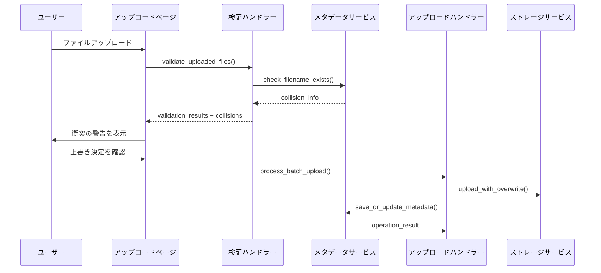

# 設計文書

## 概要

この設計では、写真アップロードプロセスにおけるファイル名衝突検出と上書き確認システムを実装します。システムは検証中に既存ファイルを検出し、潜在的な上書きについてユーザーに警告し、ユーザーが上書きを選択した場合に適切にデータベース更新を処理します。

## アーキテクチャ

### 高レベルフロー

1. **ファイル検証フェーズ**: 衝突検出を含むように拡張
2. **ユーザー確認フェーズ**: 警告を表示し、ユーザーの決定を収集
3. **アップロード処理フェーズ**: 新規アップロードと上書きの両方を処理
4. **データベース操作フェーズ**: 新規ファイルにはINSERT、上書きにはUPDATEを使用

### コンポーネント間の相互作用



## コンポーネントとインターフェース

### 1. 拡張された検証ハンドラー

**場所**: `src/imgstream/ui/upload_handlers.py`

**新しい関数**:
```python
def check_filename_collisions(user_id: str, filenames: list[str]) -> dict[str, dict]
def validate_uploaded_files_with_collision_check(uploaded_files: list) -> tuple[list, list, dict]
def render_collision_warnings(collision_info: dict) -> None
```

**拡張された関数**:
- `validate_uploaded_files()` - 衝突検出を追加
- `render_file_validation_results()` - 衝突警告を含める

### 2. 拡張されたメタデータサービス

**場所**: `src/imgstream/services/metadata.py`

**新しい関数**:
```python
def check_filename_exists(self, filename: str) -> dict | None
def update_photo_metadata(self, photo_metadata: PhotoMetadata) -> None
```

**拡張された関数**:
- `save_photo_metadata()` - INSERTとUPDATE操作の両方をサポート

### 3. 拡張されたアップロードページ

**場所**: `src/imgstream/ui/pages/upload.py`

**新しいセッション状態変数**:
- `collision_info`: 衝突詳細の辞書
- `overwrite_decisions`: 各衝突に対するユーザーの決定
- `collision_warnings_shown`: 警告が表示されたかを追跡

**拡張された関数**:
- 衝突検出を含むファイル検証フロー
- 衝突警告を表示するUIレンダリング
- 上書き確認を処理するアップロードボタンロジック

### 4. 拡張されたアップロード処理

**場所**: `src/imgstream/ui/upload_handlers.py`

**拡張された関数**:
- `process_single_upload()` - 上書きモードを処理
- `process_batch_upload()` - 新規/上書き混合操作を処理

## データモデル

### 衝突情報構造

```python
collision_info = {
    "filename.jpg": {
        "existing_photo": PhotoMetadata,  # 既存写真メタデータ
        "user_decision": "pending" | "overwrite" | "skip",
        "warning_shown": bool,
        "existing_file_info": {
            "upload_date": datetime,
            "file_size": int,
            "creation_date": datetime
        }
    }
}
```

### 拡張されたPhotoMetadata操作

既存の`PhotoMetadata`モデルを拡張された操作で使用:

- **INSERT**: 新規写真用（既存の動作）
- **UPDATE**: 上書き操作用、以下を保持:
  - `id` (写真ID)
  - `created_at` (元の作成日時)
  - `user_id`

上書き時に更新されるフィールド:
- `uploaded_at` (新しいアップロード日時)
- `file_size` (新しいファイルサイズ)
- `original_path` (新しいGCSパス)
- `thumbnail_path` (新しいサムネイルパス)
- `mime_type` (潜在的に更新)

## エラーハンドリング

### 衝突検出エラー

- **データベースクエリ失敗**: エラーをログに記録し、衝突なしとして扱う
- **メタデータサービス利用不可**: 警告を表示し、アップロードを続行可能にする
- **パフォーマンス問題**: 衝突チェックのタイムアウトを実装

### 上書き操作エラー

- **GCSアップロード失敗**: 元のファイルを保持し、エラーを表示
- **データベース更新失敗**: 可能であればGCS変更をロールバック
- **部分的失敗**: 混合バッチ結果の明確なエラー報告

### ユーザーエクスペリエンスエラー

- **不明確な警告**: 詳細な衝突情報を提供
- **偶発的な上書き**: 明示的な確認を要求
- **決定の紛失**: セッション状態で上書き決定を永続化

## テスト戦略

### ユニットテスト

1. **衝突検出テスト**
   - ファイル名衝突検出の精度をテスト
   - 大きな写真コレクションでのパフォーマンスをテスト
   - エッジケース（特殊文字、長いファイル名）をテスト

2. **データベース操作テスト**
   - INSERT vs UPDATEロジックをテスト
   - 更新中のメタデータ保持をテスト
   - トランザクションロールバックシナリオをテスト

3. **UIコンポーネントテスト**
   - 衝突警告表示をテスト
   - ユーザー決定収集をテスト
   - セッション状態管理をテスト

### 統合テスト

1. **エンドツーエンドアップロードテスト**
   - 完全な衝突検出と上書きフローをテスト
   - 混合バッチアップロード（新規 + 上書き）をテスト
   - エラー回復シナリオをテスト

2. **データベース整合性テスト**
   - 上書き中のデータ整合性をテスト
   - 同時アップロードシナリオをテスト
   - GCS-データベース同期をテスト

### パフォーマンステスト

1. **衝突検出パフォーマンス**
   - 大量の既存写真でテスト
   - バッチ衝突検出効率をテスト
   - データベースクエリ最適化をテスト

2. **アップロードパフォーマンス**
   - 上書き操作パフォーマンス vs 新規アップロードをテスト
   - 混合操作でのバッチ処理をテスト

## 実装詳細

### フェーズ1: 衝突検出

1. **MetadataServiceの拡張**
   - `check_filename_exists()`メソッドを追加
   - ファイル名検索のデータベースクエリを最適化
   - 衝突検出イベントのログ記録を追加

2. **検証ハンドラーの更新**
   - 検証フローに衝突検出を統合
   - 衝突情報データ構造を作成
   - 衝突固有の検証結果を追加

### フェーズ2: ユーザーインターフェース

1. **拡張された検証結果表示**
   - 衝突警告セクションを追加
   - 既存ファイル情報を表示
   - 明確な上書きオプションを提供

2. **セッション状態管理**
   - 衝突情報を追跡
   - ユーザーの上書き決定を保存
   - UI相互作用間で状態を維持

### フェーズ3: アップロード処理

1. **拡張されたアップロードロジック**
   - 新規アップロードと上書きを区別
   - 混合バッチ操作を処理
   - 上書きの適切なエラーハンドリングを実装

2. **データベース操作**
   - 上書きのUPDATE操作を実装
   - 更新中に重要なメタデータを保持
   - トランザクション整合性を確保

### フェーズ4: テストと最適化

1. **包括的テスト**
   - すべての新しいコンポーネントのユニットテスト
   - 完全フローの統合テスト
   - 衝突検出のパフォーマンステスト

2. **パフォーマンス最適化**
   - データベースクエリを最適化
   - 効率的なバッチ衝突検出を実装
   - 有益な場所に適切なキャッシュを追加

## セキュリティ考慮事項

### ユーザーアクセス制御

- 衝突検出は現在のユーザーが所有するファイルのみをチェック
- 上書き操作はユーザー自身のファイルに制限
- ユーザー間のファイルアクセスや情報漏洩なし

### データ整合性

- 上書きプロセスのアトミック操作
- データ損失を防ぐ適切なエラーハンドリング
- 上書きされたファイルのバックアップ考慮

### 入力検証

- データベースクエリのファイル名をサニタイズ
- 処理前にユーザー決定を検証
- ファイル名操作によるインジェクション攻撃を防止

## 監視とログ記録

### 主要メトリクス

- 衝突検出頻度
- 上書き操作成功率
- ユーザー決定パターン（上書き vs スキップ）
- 衝突検出のパフォーマンスメトリクス

### ログイベント

- ファイル名衝突検出
- ユーザーの上書き決定
- 成功した上書き操作
- 失敗した上書き試行
- 遅い衝突検出のパフォーマンス警告

## 後方互換性

### 既存データ

- すべての既存写真は変更なしで動作継続
- 既存メタデータの移行は不要
- 既存のアップロードフローは機能を維持

### API互換性

- すべての既存関数はシグネチャを維持
- 新機能は追加のみ
- 既存インターフェースへの破壊的変更なし
