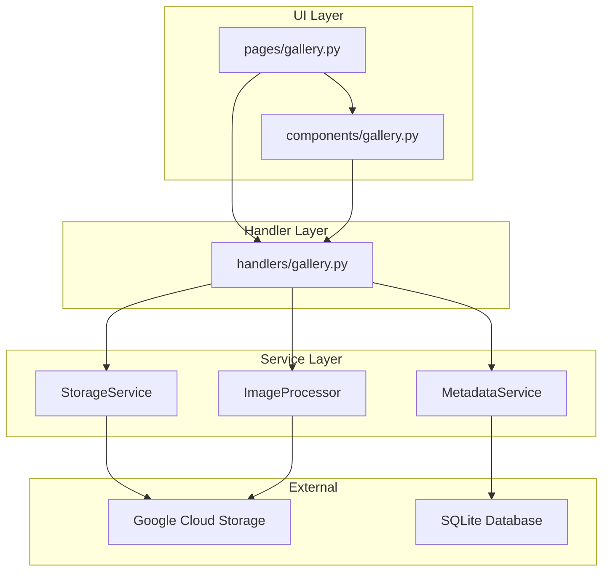
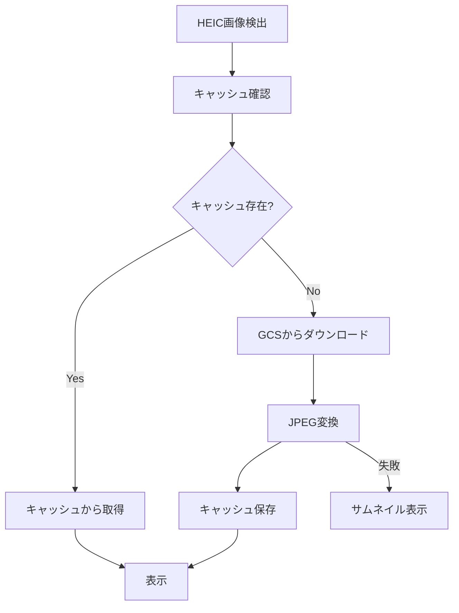

# 設計書

## 概要

ギャラリー機能のリファクタリングとUI改善により、コードの保守性向上とユーザー体験の改善を実現する。モジュール分離、モーダル表示、HEIC対応、キャッシュ最適化を通じて、スケーラブルで使いやすいギャラリーシステムを構築する。

## アーキテクチャ

### レイヤー分離アーキテクチャ



### コンポーネント責任分離

- **Pages**: ページレベルのオーケストレーション、認証、状態管理
- **Components**: UI描画、ユーザーインタラクション、表示ロジック
- **Handlers**: ビジネスロジック、データ変換、外部サービス連携

## コンポーネントとインターフェース

### 1. ページレイヤー (`ui/pages/gallery.py`)

**責任**:
- 認証チェック
- セッション状態管理
- コンポーネントとハンドラーのオーケストレーション
- エラーハンドリング

**主要機能**:
```python
def render_gallery_page() -> None
def initialize_gallery_pagination() -> None
```

### 2. コンポーネントレイヤー (`ui/components/gallery.py`)

**責任**:
- UI要素の描画
- ユーザーインタラクション
- 表示フォーマット

**主要コンポーネント**:
```python
def render_photo_grid(photos: list[dict]) -> None
def render_photo_list(photos: list[dict]) -> None
def render_photo_thumbnail(photo: dict, size: str) -> None
def render_photo_detail_image(photo: dict) -> None
def render_photo_detail_sidebar(photo: dict) -> None
def render_gallery_header(photos: list, total_count: int, has_more: bool) -> None
def render_pagination_controls(has_more: bool, total_count: int) -> None
```

### 3. ハンドラーレイヤー (`ui/handlers/gallery.py`)

**責任**:
- データ取得と変換
- ビジネスロジック
- 外部サービス連携
- キャッシュ管理

**主要ハンドラー**:
```python
def load_user_photos_paginated(user_id: str, sort_order: str, page: int, page_size: int) -> tuple
def convert_heic_to_web_display(original_path: str, photo_id: str) -> bytes | None
def get_photo_thumbnail_url(thumbnail_path: str, photo_id: str) -> str | None
def get_photo_original_url(original_path: str, photo_id: str) -> str | None
def download_original_photo(photo: dict) -> None
```

## データモデル

### 写真メタデータ構造

```python
PhotoDict = {
    "id": str,                    # 写真ID
    "filename": str,              # ファイル名
    "original_path": str,         # オリジナル画像のGCSパス
    "thumbnail_path": str,        # サムネイル画像のGCSパス
    "file_size": int,            # ファイルサイズ（バイト）
    "created_at": str | datetime, # 作成日時
    "uploaded_at": str | datetime,# アップロード日時
    "content_type": str,         # MIMEタイプ
}
```

### ページネーション状態

```python
PaginationState = {
    "gallery_page": int,          # 現在のページ（0ベース）
    "gallery_page_size": int,     # 1ページあたりの写真数
    "gallery_sort_order": str,    # ソート順序
    "gallery_total_loaded": int,  # 読み込み済み写真数
    "gallery_photos": list,       # 現在のページの写真
}
```

## エラーハンドリング

### エラー分類と対応

1. **画像読み込みエラー**
   - HEIC変換失敗 → サムネイルフォールバック
   - URL生成失敗 → エラーメッセージ表示
   - ネットワークエラー → リトライ提案

2. **データベースエラー**
   - 接続失敗 → 空状態表示
   - クエリエラー → ログ記録とエラー表示

3. **ストレージエラー**
   - ファイル不存在 → 代替表示
   - 権限エラー → 認証確認

### エラーメッセージ設計

```python
ErrorMessages = {
    "heic_conversion_failed": "HEIC画像の変換に失敗しました",
    "image_load_failed": "画像の読み込みに失敗しました",
    "download_failed": "ダウンロードリンクの生成に失敗しました",
    "database_error": "データベースエラーが発生しました",
    "storage_error": "ストレージアクセスエラーが発生しました",
}
```

## テスト戦略

### ユニットテスト

**コンポーネントテスト**:
- UI描画ロジックのテスト（モック使用）
- プロパティ渡しのテスト
- エラー状態の表示テスト
- モーダル表示のテスト

**ハンドラーテスト**:
- データ変換ロジックのテスト
- 外部サービスのモックテスト
- キャッシュ動作のテスト
- HEIC変換ロジックのテスト
- URL生成ロジックのテスト

**ページテスト**:
- 認証チェックのテスト
- セッション状態管理のテスト
- エラーハンドリングのテスト

## モーダル表示設計

### st.dialog実装

```python
@st.dialog(title=f"{photo.get('filename', '不明')}", width="large")
def show_photo_dialog():
    col1, col2 = st.columns([3, 1])
    with col1:
        render_photo_detail_image(photo)
    with col2:
        render_photo_detail_sidebar(photo)
```

### レイアウト設計

- **左側（3/4）**: フルサイズ画像表示
- **右側（1/4）**: メタデータとアクション
- **レスポンシブ対応**: モバイルでは縦積み

## HEIC対応設計

### 変換フロー



### 変換パラメータ

- **品質**: 85%（Web表示最適化）
- **最大サイズ**: 1920x1080（フルHD）
- **キャッシュ期間**: 24時間

## キャッシュ戦略

### キャッシュレベル

1. **写真リスト**: 5分間（頻繁な更新対応）
2. **署名付きURL**: 50分間（1時間有効期限の余裕）
3. **HEIC変換**: 24時間（変換コスト削減）

### キャッシュキー設計

```python
cache_keys = {
    "photos": f"photos_{user_id}_{sort_order}_{page}_{page_size}_{rerun_counter}",
    "thumbnail_url": f"thumbnail_{thumbnail_path}_{photo_id}",
    "original_url": f"original_{original_path}_{photo_id}",
    "heic_conversion": f"heic_{original_path}_{photo_id}",
}
```

## パフォーマンス最適化

### 1. 遅延読み込み

- ページネーション（20枚/ページ）
- サムネイル優先読み込み
- オンデマンドHEIC変換

### 2. 並列処理

- 複数画像の同時読み込み
- バックグラウンドでの事前変換
- 非同期URL生成

### 3. メモリ管理

- 大画像の適切なリサイズ
- 不要なキャッシュの自動削除
- セッション状態の最適化

## セキュリティ考慮事項

### 1. アクセス制御

- ユーザー認証の必須化
- 写真所有者の確認
- 署名付きURLの期限管理

### 2. データ保護

- 画像データの暗号化転送
- メタデータの適切なサニタイズ
- ログでの個人情報マスキング

### 3. エラー情報の制限

- 内部エラーの詳細非表示
- ユーザーフレンドリーなメッセージ
- セキュリティログの記録
