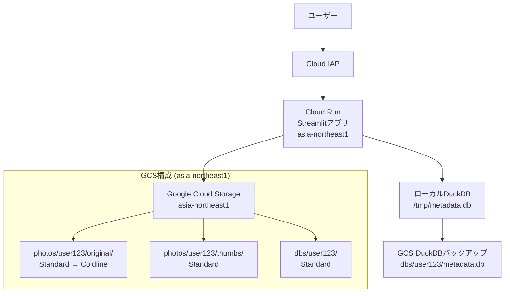

# 設計書

## 概要

この設計書は、個人向け写真管理Webアプリケーションの技術的な実装方針を定義します。システムはStreamlitベースのフロントエンド、Google Cloud Storage（GCS）でのファイル保存、DuckDBでのメタデータ管理、Cloud IAPでの認証を組み合わせて構築されます。

## アーキテクチャ

### システム全体構成



### 技術スタック

- **フロントエンド**: Streamlit (Python)
- **バックエンド**: Python (Cloud Run, asia-northeast1)
- **認証**: Google Cloud IAP
- **ストレージ**: Google Cloud Storage (asia-northeast1)
- **メタデータDB**: DuckDB
- **画像処理**: Pillow, pillow-heif
- **パッケージ管理**: uv
- **インフラ管理**: Terraform
- **デプロイ**: Cloud Run (asia-northeast1)

## コンポーネントとインターフェース

### 1. 認証コンポーネント (AuthService)

**責任**: Cloud IAP認証の処理とユーザー識別

```python
class AuthService:
    def get_current_user() -> str:
        """Cloud IAPヘッダーからユーザーIDを取得"""
        
    def is_authenticated() -> bool:
        """認証状態の確認"""
        
    def get_user_storage_path(user_id: str) -> str:
        """ユーザー固有のストレージパスを生成"""
```

**設計決定**:
- Cloud IAPのX-Goog-IAP-JWT-Assertionヘッダーを使用してユーザー識別
- ユーザーIDはemailまたはsubjectクレームを使用
- 認証失敗時はStreamlitのstop()で処理を停止

### 2. ストレージサービス (StorageService)

**責任**: GCSとの連携、ファイルアップロード・ダウンロード

```python
class StorageService:
    def upload_original_photo(user_id: str, file_data: bytes, filename: str) -> str:
        """オリジナル写真をGCSにアップロード"""
        
    def upload_thumbnail(user_id: str, thumbnail_data: bytes, original_filename: str) -> str:
        """サムネイルをGCSにアップロード"""
        
    def download_file(gcs_path: str) -> bytes:
        """GCSからファイルをダウンロード"""
        
    def get_signed_url(gcs_path: str, expiration: int = 3600) -> str:
        """署名付きURLを生成（画像表示用）"""
```

**設計決定**:
- バケット構成: `photos/user123/original/` と `photos/user123/thumbs/`
- ライフサイクルポリシーでオリジナル写真を30日後にColdlineに移行
- 署名付きURLで安全な画像アクセスを実現

### 3. 画像処理サービス (ImageProcessor)

**責任**: 画像のメタデータ抽出、サムネイル生成

```python
class ImageProcessor:
    def extract_exif_date(image_data: bytes) -> datetime:
        """EXIF情報から撮影日時を抽出"""
        
    def generate_thumbnail(image_data: bytes, max_size: tuple = (300, 300)) -> bytes:
        """サムネイル画像を生成"""
        
    def is_supported_format(filename: str) -> bool:
        """サポートされている画像形式かチェック"""
```

**設計決定**:
- HEIC形式のサポートにpillow-heifライブラリを使用
- サムネイルサイズは300x300ピクセル（アスペクト比維持）
- EXIF DateTimeOriginal → DateTime → DateTimeDigitized の優先順で日時取得
- ファイルサイズ制限は環境変数で設定可能（運用時調整対応）
  - `MAX_FILE_SIZE`: 最大ファイルサイズ（バイト単位、デフォルト: 50MB）
  - `MIN_FILE_SIZE`: 最小ファイルサイズ（バイト単位、デフォルト: 100バイト）

### 4. メタデータサービス (MetadataService)

**責任**: DuckDBでのメタデータ管理

```python
class MetadataService:
    def initialize_db(user_id: str) -> None:
        """ユーザー用DuckDBファイルの初期化"""
        
    def save_photo_metadata(photo_metadata: PhotoMetadata) -> None:
        """写真メタデータの保存"""
        
    def get_photos_by_date(user_id: str, limit: int = 50) -> List[PhotoMetadata]:
        """作成日順で写真一覧を取得"""
        
    def sync_db_to_gcs(user_id: str) -> None:
        """DuckDBファイルをGCSに非同期バックアップ"""
```

**設計決定**:
- 各ユーザーに独立したDuckDBファイル（`/tmp/metadata_{user_id}.db`）
- 起動時にGCSからローカルにダウンロード、更新時に非同期でアップロード
- インデックス: created_at, uploaded_at

## データモデル

### DuckDBスキーマ

```sql
CREATE TABLE photos (
    id TEXT PRIMARY KEY,
    user_id TEXT NOT NULL,
    filename TEXT NOT NULL,
    original_path TEXT NOT NULL,
    thumbnail_path TEXT NOT NULL,
    created_at TIMESTAMP,
    uploaded_at TIMESTAMP NOT NULL DEFAULT CURRENT_TIMESTAMP,
    file_size INTEGER,
    mime_type TEXT
);

CREATE INDEX idx_photos_created_at ON photos(created_at DESC);
CREATE INDEX idx_photos_user_id ON photos(user_id);
```

### PhotoMetadataクラス

```python
@dataclass
class PhotoMetadata:
    id: str
    user_id: str
    filename: str
    original_path: str
    thumbnail_path: str
    created_at: Optional[datetime]
    uploaded_at: datetime
    file_size: int
    mime_type: str
```

## エラーハンドリング

### エラー分類と対応

1. **認証エラー**
   - Cloud IAP認証失敗 → アクセス拒否メッセージ表示
   - 不正なユーザーID → ログ記録とエラーページ

2. **アップロードエラー**
   - サポートされていないファイル形式 → ユーザーにエラーメッセージ
   - ファイルサイズ制限超過 → 制限値を表示してリトライ促進
   - GCSアップロード失敗 → リトライ機構とエラーログ

3. **データベースエラー**
   - DuckDB接続失敗 → 新規DB作成を試行
   - GCSからのDB同期失敗 → ローカルDBで継続、バックグラウンドでリトライ

4. **画像処理エラー**
   - EXIF読み取り失敗 → アップロード日時を作成日時として使用
   - サムネイル生成失敗 → デフォルトアイコンを使用

### エラーログ戦略

```python
import logging
import structlog

logger = structlog.get_logger()

# 構造化ログでエラー追跡
logger.error("photo_upload_failed", 
            user_id=user_id, 
            filename=filename, 
            error=str(e))
```

## テスト戦略

### 単体テスト

1. **AuthServiceテスト**
   - Cloud IAPヘッダーの正常/異常パターン
   - ユーザーID抽出の各種形式

2. **ImageProcessorテスト**
   - HEIC/JPEG形式の処理
   - EXIF情報の抽出パターン
   - サムネイル生成の品質確認

3. **MetadataServiceテスト**
   - DuckDB CRUD操作
   - 同期処理の正常/異常系

### 統合テスト

1. **アップロードフロー**
   - ファイル選択 → アップロード → メタデータ保存 → 表示
   - エラー発生時のロールバック

2. **認証フロー**
   - Cloud IAP認証 → ユーザー固有データアクセス

### パフォーマンステスト

1. **大量ファイルアップロード**
   - 100枚同時アップロードでの応答時間
   - メモリ使用量の監視

2. **サムネイル表示速度**
   - 1000枚の写真での初期表示時間
   - スクロール時の遅延測定

## セキュリティ考慮事項

### 認証・認可

- Cloud IAPによる外部認証
- ユーザー間のデータ完全分離
- GCS署名付きURLによる安全な画像アクセス

### データ保護

- 転送時暗号化（HTTPS）
- 保存時暗号化（GCS標準）
- 個人情報の最小化（メタデータのみ保存）

### アクセス制御

```python
def ensure_user_access(user_id: str, resource_path: str) -> bool:
    """ユーザーが自分のリソースにのみアクセスできることを確認"""
    return resource_path.startswith(f"photos/{user_id}/")
```

## パフォーマンス最適化

### フロントエンド最適化

1. **遅延読み込み**
   - 初期表示は最新50枚のサムネイル
   - スクロール時の追加読み込み

2. **キャッシュ戦略**
   - Streamlitの@st.cache_dataでメタデータキャッシュ
   - ブラウザキャッシュでサムネイル画像

### バックエンド最適化

1. **非同期処理**
   - DuckDBのGCS同期を非同期実行
   - サムネイル生成の並列処理

2. **メモリ管理**
   - 大きな画像ファイルのストリーミング処理
   - 不要なオブジェクトの適切な解放

## 環境変数設定

### アプリケーション設定

システムの動作は以下の環境変数で調整可能です：

#### 画像処理設定

| 環境変数名 | デフォルト値 | 説明 |
|-----------|-------------|------|
| `MAX_FILE_SIZE` | `52428800` (50MB) | アップロード可能な最大ファイルサイズ（バイト単位） |
| `MIN_FILE_SIZE` | `100` | アップロード可能な最小ファイルサイズ（バイト単位） |
| `THUMBNAIL_MAX_SIZE` | `300` | サムネイルの最大サイズ（ピクセル） |
| `THUMBNAIL_QUALITY` | `85` | サムネイルのJPEG品質（1-100） |

#### 使用例

```bash
# 最大ファイルサイズを100MBに設定
export MAX_FILE_SIZE=104857600

# 最小ファイルサイズを1KBに設定
export MIN_FILE_SIZE=1024

# サムネイルサイズを400pxに設定
export THUMBNAIL_MAX_SIZE=400
```

#### Cloud Run での設定

```yaml
# cloud-run-service.yaml
apiVersion: serving.knative.dev/v1
kind: Service
metadata:
  name: imgstream
spec:
  template:
    metadata:
      annotations:
        run.googleapis.com/execution-environment: gen2
    spec:
      containers:
      - image: gcr.io/PROJECT_ID/imgstream
        env:
        - name: MAX_FILE_SIZE
          value: "104857600"  # 100MB
        - name: MIN_FILE_SIZE
          value: "1024"       # 1KB
        - name: THUMBNAIL_MAX_SIZE
          value: "400"
        - name: THUMBNAIL_QUALITY
          value: "90"
```

## 運用・監視

### ログ設計

```python
# 構造化ログの例
logger.info("photo_uploaded", 
           user_id=user_id,
           filename=filename,
           file_size=file_size,
           processing_time=processing_time)
```

### メトリクス監視

1. **アプリケーションメトリクス**
   - アップロード成功/失敗率
   - 平均処理時間
   - アクティブユーザー数

2. **インフラメトリクス (asia-northeast1)**
   - Cloud Runのメモリ/CPU使用率
   - GCSストレージ使用量
   - 無料枠使用状況
   - リージョン間データ転送コスト
   - レイテンシ（日本国内からのアクセス最適化）

### アラート設定

- エラー率が5%を超えた場合
- 応答時間が10秒を超えた場合
- 無料枠使用量が80%を超えた場合

## デプロイメント戦略

### プロジェクト構成

```
imgstream/
├── pyproject.toml          # uv設定とプロジェクト依存関係
├── uv.lock                 # ロックファイル
├── src/
│   └── imgstream/
│       ├── __init__.py
│       ├── main.py         # Streamlitアプリケーション
│       ├── services/       # サービスクラス
│       └── models/         # データモデル
├── tests/                  # テストファイル
├── Dockerfile              # uvを使用したマルチステージビルド
├── terraform/              # インフラ定義
└── .github/workflows/      # CI/CDパイプライン
```

### uv設定 (pyproject.toml)

```toml
[project]
name = "imgstream"
version = "0.1.0"
description = "Personal photo management web application with Streamlit"
requires-python = ">=3.11"
dependencies = [
    "streamlit>=1.28.0",
    "google-cloud-storage>=2.10.0",
    "google-auth>=2.23.0",
    "duckdb>=0.9.0",
    "pillow>=10.0.0",
    "pillow-heif>=0.13.0",
    "structlog>=23.1.0",
    "python-multipart>=0.0.6",
]

[project.optional-dependencies]
dev = [
    "pytest>=7.4.0",
    "pytest-asyncio>=0.21.0",
    "black>=23.7.0",
    "ruff>=0.0.287",
    "mypy>=1.5.0",
]

[build-system]
requires = ["hatchling"]
build-backend = "hatchling.build"

[tool.uv]
dev-dependencies = [
    "pytest>=7.4.0",
    "pytest-asyncio>=0.21.0",
    "black>=23.7.0",
    "ruff>=0.0.287",
    "mypy>=1.5.0",
]
```

### Dockerfile (uvを使用したマルチステージビルド)

```dockerfile
# ビルドステージ
FROM python:3.11-slim as builder

# uvのインストール
COPY --from=ghcr.io/astral-sh/uv:latest /uv /bin/uv

# 作業ディレクトリの設定
WORKDIR /app

# プロジェクトファイルのコピー
COPY pyproject.toml uv.lock ./

# 依存関係のインストール
RUN uv sync --frozen --no-dev

# 実行ステージ
FROM python:3.11-slim

# 必要なシステムパッケージのインストール
RUN apt-get update && apt-get install -y \
    libheif1 \
    && rm -rf /var/lib/apt/lists/*

# 作業ディレクトリの設定
WORKDIR /app

# ビルドステージから仮想環境をコピー
COPY --from=builder /app/.venv /app/.venv

# アプリケーションコードのコピー
COPY src/ ./src/

# 環境変数の設定
ENV PATH="/app/.venv/bin:$PATH"
ENV PYTHONPATH="/app/src"

# ポート設定
EXPOSE 8080

# アプリケーション起動
CMD ["streamlit", "run", "src/imgstream/main.py", "--server.port=8080", "--server.address=0.0.0.0"]
```

### Terraform構成

```hcl
# 主要リソース (asia-northeast1 リージョン)
resource "google_cloud_run_service" "imgstream" {
  name     = "imgstream"
  location = "asia-northeast1"
  
  template {
    spec {
      containers {
        image = "gcr.io/${var.project_id}/imgstream:latest"
        env {
          name  = "GCS_REGION"
          value = "asia-northeast1"
        }
      }
    }
  }
}

resource "google_storage_bucket" "imgstream_photos" {
  name     = "${var.project_id}-imgstream-photos"
  location = "asia-northeast1"
  
  lifecycle_rule {
    condition {
      age = 30
    }
    action {
      type          = "SetStorageClass"
      storage_class = "COLDLINE"
    }
  }
}

# その他のリソース:
# - Cloud IAP 設定
# - サービスアカウント
# - Container Registry / Artifact Registry
```

### CI/CD パイプライン (.github/workflows/deploy.yml)

```yaml
name: Deploy to Cloud Run

on:
  push:
    branches: [main]
  pull_request:
    branches: [main]

jobs:
  test:
    runs-on: ubuntu-latest
    steps:
      - uses: actions/checkout@v4
      
      - name: Install uv
        uses: astral-sh/setup-uv@v1
        with:
          version: "latest"
      
      - name: Set up Python
        run: uv python install 3.11
      
      - name: Install dependencies
        run: uv sync
      
      - name: Run linting
        run: |
          uv run ruff check .
          uv run black --check .
      
      - name: Run type checking
        run: uv run mypy src/
      
      - name: Run tests
        run: uv run pytest

  build-and-deploy:
    if: github.ref == 'refs/heads/main'
    needs: test
    runs-on: ubuntu-latest
    steps:
      - uses: actions/checkout@v4
      
      - name: Setup Google Cloud CLI
        uses: google-github-actions/setup-gcloud@v1
        with:
          service_account_key: ${{ secrets.GCP_SA_KEY }}
          project_id: ${{ secrets.GCP_PROJECT_ID }}
      
      - name: Configure Docker
        run: gcloud auth configure-docker
      
      - name: Build Docker image
        run: |
          docker build -t gcr.io/${{ secrets.GCP_PROJECT_ID }}/imgstream:${{ github.sha }} .
          docker push gcr.io/${{ secrets.GCP_PROJECT_ID }}/imgstream:${{ github.sha }}
      
      - name: Deploy to Cloud Run
        run: |
          gcloud run deploy imgstream \
            --image gcr.io/${{ secrets.GCP_PROJECT_ID }}/imgstream:${{ github.sha }} \
            --platform managed \
            --region asia-northeast1 \
            --allow-unauthenticated
```

### 開発環境セットアップ

```bash
# プロジェクトのクローン
git clone <repository-url>
cd imgstream

# uvで依存関係をインストール
uv sync

# 開発サーバーの起動
uv run streamlit run src/imgstream/main.py

# テストの実行
uv run pytest

# コード品質チェック
uv run ruff check .
uv run black .
uv run mypy src/
```

この設計書は、要件定義書で定義されたすべての機能要件と非機能要件を満たすための技術的な実装方針を提供します。

## フロントエンドアーキテクチャ

### main.py分割方針

main.pyが肥大化してきたため、以下の方針で機能別にモジュールを分割します：

#### 分割対象モジュール

```
src/imgstream/
├── main.py                    # エントリーポイント、アプリケーション設定
├── ui/
│   ├── __init__.py
│   ├── auth_handlers.py       # 認証関連の処理
│   ├── upload_handlers.py     # アップロード関連の処理  
│   ├── components.py          # 再利用可能なUIコンポーネント
│   └── pages/
│       ├── __init__.py
│       ├── home.py           # ホームページ
│       ├── upload.py         # アップロードページ
│       ├── gallery.py        # ギャラリーページ
│       └── settings.py       # 設定ページ
└── services/                  # 既存のサービス層
```

#### 各モジュールの責任

**main.py**
- Streamlitアプリケーションの設定とエントリーポイント
- 構造化ログの設定
- ページルーティング
- セッション状態の初期化

**ui/auth_handlers.py**
- 認証処理（authenticate_user, handle_logout, require_authentication）
- 認証状態の管理
- 認証エラーハンドリング

**ui/upload_handlers.py**
- ファイルアップロードのバリデーション
- アップロード処理のロジック
- ファイル形式・サイズチェック

**ui/components.py**
- 再利用可能なUIコンポーネント（render_empty_state, render_error_message, render_info_card）
- 共通のヘルパー関数（format_file_size等）
- レイアウト関連のユーティリティ

**ui/pages/*.py**
- 各ページの描画ロジック
- ページ固有の状態管理
- ページ間の連携処理

#### 分割の利点

1. **保守性の向上**: 機能別に分離されることで、変更の影響範囲が明確
2. **テスタビリティ**: 各モジュールを独立してテスト可能
3. **再利用性**: UIコンポーネントの再利用が容易
4. **可読性**: ファイルサイズが適切になり、コードの理解が容易
5. **並行開発**: 複数の開発者が異なるモジュールを同時に開発可能

#### インポート戦略

- 各モジュールは必要最小限の依存関係のみをインポート
- 循環インポートを避けるため、共通の依存関係はcomponents.pyに配置
- サービス層（services/）への依存は各モジュールで直接インポート
