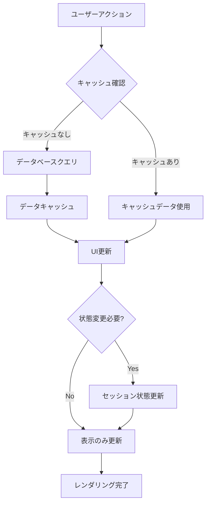

# 設計書

## 概要

imgstreamアプリケーションのStreamlit状態管理を最適化し、不要な再読み込みを削減するための包括的な設計です。現在の実装では、多数の`st.rerun()`呼び出しとキャッシュ機能の未使用により、パフォーマンスの問題が発生しています。

## アーキテクチャ

### 現在の問題点

1. **過度なst.rerun()使用**: 27箇所でst.rerun()が使用されており、不要なページ再読み込みを引き起こしている
2. **キャッシュ機能の未使用**: @st.cache_dataや@st.cache_resourceが全く使用されていない
3. **状態管理の非効率性**: セッション状態の適切な活用ができていない
4. **データベースクエリの重複**: 同じデータを繰り返し取得している

### 新しいアーキテクチャ



## コンポーネントとインターフェース

### 1. キャッシュ管理システム

#### ThumbnailCacheManager
```python
class ThumbnailCacheManager:
    """サムネイルURLのキャッシュ管理を行うクラス"""

    @staticmethod
    @st.cache_data(ttl=3600)  # 1時間キャッシュ
    def get_thumbnail_url_cached(photo_id: str, thumbnail_path: str) -> str

    @staticmethod
    @st.cache_resource
    def get_storage_service() -> StorageService

    @staticmethod
    def invalidate_thumbnail_cache(photo_id: str) -> None
```

### 2. 状態管理システム

#### GalleryStateManager
```python
class GalleryStateManager:
    """ギャラリーページの状態管理を行うクラス"""

    @staticmethod
    def initialize_gallery_state() -> None

    @staticmethod
    def update_pagination_state(page: int, page_size: int) -> None

    @staticmethod
    def update_view_state(view_mode: str, sort_order: str) -> None

    @staticmethod
    def get_current_state() -> dict
```

### 3. 最適化されたUI更新システム

#### SmartUIUpdater
```python
class SmartUIUpdater:
    """UI更新を最適化するクラス"""

    @staticmethod
    def update_photo_grid(photos: list, force_refresh: bool = False) -> None

    @staticmethod
    def update_pagination_controls(current_page: int, total_pages: int) -> None

    @staticmethod
    def show_photo_modal(photo: dict) -> None
```

## データモデル

### キャッシュキー構造
```python
# サムネイルURLキャッシュ
THUMBNAIL_CACHE_KEY = f"thumbnail_{photo_id}_{hash(thumbnail_path)}"
```

### セッション状態構造
```python
# ギャラリー状態
st.session_state.gallery = {
    "current_page": 0,
    "page_size": 20,
    "sort_order": "新しい順",
    "view_mode": "グリッド",
    "selected_photo": None,
    "show_modal": False,
    "last_update": datetime.now(),
    "cache_version": 1
}

# UI状態
st.session_state.ui = {
    "prevent_rerun": False,
    "pending_updates": [],
    "modal_state": "closed"
}
```

## エラーハンドリング

### キャッシュエラー処理
1. **キャッシュ失敗時**: 自動的にデータベースから直接取得

## テスト戦略

### 単体テスト
- サムネイルキャッシュ機能のテスト
- 状態管理ロジックのテスト
- UI更新ロジックのテスト

## 実装戦略

### フェーズ1: サムネイルキャッシュシステム導入
1. ThumbnailCacheManagerの実装
2. 既存コードへのサムネイルキャッシュ適用

### フェーズ2: 状態管理最適化
1. GalleryStateManagerの実装
2. st.rerun()呼び出しの削減
3. セッション状態の最適化

### フェーズ3: UI更新最適化
1. SmartUIUpdaterの実装
2. モーダル表示の最適化
3. ページネーション制御の改善

### フェーズ4: パフォーマンス監視
1. パフォーマンス計測の追加
2. ログ出力の最適化
3. 監視ダッシュボードの構築

## パフォーマンス目標

### 定量的目標
- ページ読み込み時間: 50%削減（現在3-5秒 → 1.5-2.5秒）
- データベースクエリ回数: 80%削減
- メモリ使用量: 30%削減
- st.rerun()呼び出し回数: 70%削減

### 定性的目標
- ユーザーインタラクションの応答性向上
- ページ遷移時の滑らかさ改善
- エラー発生率の削減
- 開発者体験の向上
