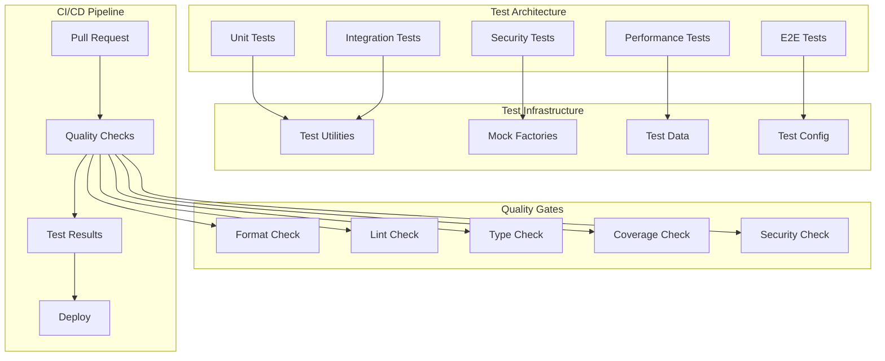

# テスト品質改善 - 設計書

## 概要

ImgStreamアプリケーションのテスト品質を向上させるための包括的な設計。認証テストの修正、CI/CD品質チェックの自動化、テストカバレッジの向上を実現する。

## アーキテクチャ設計

### テスト構造の改善



## コンポーネント設計

### 1. 認証テスト修正

#### 問題分析

現在の認証テストの主な問題：

1. **戻り値の型不整合**: テストが`UserInfo`オブジェクトを期待しているが、実装が`bool`を返している
2. **モックの不適切な設定**: 実際の実装と異なる戻り値を返すモック
3. **エラーハンドリングの不一致**: 例外処理とNone返却の混在

#### 解決策

```python
# 修正前の問題例
def test_authentication_bypass_empty_headers(self):
    result = auth_service.parse_iap_header({})
    assert result is None  # 実際はFalseが返される

# 修正後
def test_authentication_bypass_empty_headers(self):
    result = auth_service.parse_iap_header({})
    # 開発モードかどうかで戻り値が変わることを考慮
    if auth_service._is_development_mode():
        assert isinstance(result, UserInfo) or result is False
    else:
        assert result is None
```

#### 認証サービスの戻り値統一

```python
class CloudIAPAuthService:
    def parse_iap_header(self, headers: dict) -> UserInfo | None:
        """Parse IAP header and return UserInfo or None."""
        try:
            # 開発モードの場合
            if self._is_development_mode():
                return self._get_development_user()
            
            # 本番モードの場合
            jwt_token = headers.get("X-Goog-IAP-JWT-Assertion")
            if not jwt_token:
                return None
                
            return self._decode_jwt_payload(jwt_token)
        except Exception as e:
            logger.error("Authentication failed", error=str(e))
            return None
```

### 2. テストユーティリティの設計

#### テストファクトリー

```python
# tests/conftest.py
class TestDataFactory:
    @staticmethod
    def create_valid_jwt_token() -> str:
        """Create a valid JWT token for testing."""
        header = {"alg": "RS256", "typ": "JWT"}
        payload = {
            "iss": "https://cloud.google.com/iap",
            "aud": "test-audience",
            "email": "test@example.com",
            "sub": "test-user-123",
            "iat": int(time.time()),
            "exp": int(time.time()) + 3600
        }
        
        # Base64エンコード
        header_b64 = base64.urlsafe_b64encode(json.dumps(header).encode()).decode()
        payload_b64 = base64.urlsafe_b64encode(json.dumps(payload).encode()).decode()
        signature_b64 = "test-signature"
        
        return f"{header_b64}.{payload_b64}.{signature_b64}"
    
    @staticmethod
    def create_user_info(
        user_id: str = "test-user",
        email: str = "test@example.com",
        name: str = "Test User"
    ) -> UserInfo:
        """Create UserInfo object for testing."""
        return UserInfo(
            user_id=user_id,
            email=email,
            name=name,
            picture=None
        )
```

#### モックユーティリティ

```python
# tests/utils/mock_utils.py
class AuthMockUtils:
    @staticmethod
    def mock_development_mode(is_dev: bool = True):
        """Mock development mode setting."""
        return patch.object(
            CloudIAPAuthService, 
            '_is_development_mode', 
            return_value=is_dev
        )
    
    @staticmethod
    def mock_jwt_decode_success(user_info: UserInfo):
        """Mock successful JWT decoding."""
        return patch.object(
            CloudIAPAuthService,
            '_decode_jwt_payload',
            return_value=user_info
        )
    
    @staticmethod
    def mock_jwt_decode_failure():
        """Mock JWT decoding failure."""
        return patch.object(
            CloudIAPAuthService,
            '_decode_jwt_payload',
            side_effect=ValueError("Invalid JWT")
        )
```

### 3. CI/CD品質チェック自動化

#### GitHub Actions ワークフロー設計

```yaml
# .github/workflows/quality-check.yml
name: Quality Check

on:
  pull_request:
    branches: [main, develop]
  push:
    branches: [main, develop]

jobs:
  quality-check:
    name: Code Quality Check
    runs-on: ubuntu-latest
    
    steps:
      - name: Checkout code
        uses: actions/checkout@v4
        
      - name: Set up Python
        uses: actions/setup-python@v4
        with:
          python-version: "3.11"
          
      - name: Install uv
        uses: astral-sh/setup-uv@v2
        
      - name: Install dependencies
        run: uv sync --dev
        
      - name: Format check (Black)
        run: uv run black --check --diff .
        
      - name: Lint check (Ruff)
        run: uv run ruff check .
        
      - name: Type check (MyPy)
        run: uv run mypy src/ --config-file=mypy.ini
        
      - name: Security check (Bandit)
        run: uv run bandit -r src/ -f json -o bandit-report.json
        continue-on-error: true
        
      - name: Unit tests with coverage
        run: |
          ENVIRONMENT=production uv run pytest tests/unit/ \
            --cov=src --cov-report=xml --cov-report=term-missing \
            --cov-fail-under=80
            
      - name: Security tests
        run: |
          ENVIRONMENT=production uv run pytest tests/security/ \
            -v --tb=short
            
      - name: Upload coverage to Codecov
        uses: codecov/codecov-action@v3
        with:
          file: ./coverage.xml
          flags: unittests
          name: codecov-umbrella
```

#### 品質ゲートの設定

```python
# scripts/quality-gate.py
class QualityGate:
    def __init__(self):
        self.checks = []
        self.failed_checks = []
    
    def add_check(self, name: str, command: str, threshold: float = None):
        """Add a quality check."""
        self.checks.append({
            'name': name,
            'command': command,
            'threshold': threshold
        })
    
    def run_all_checks(self) -> bool:
        """Run all quality checks."""
        all_passed = True
        
        for check in self.checks:
            if not self._run_check(check):
                all_passed = False
                self.failed_checks.append(check['name'])
        
        return all_passed
    
    def _run_check(self, check: dict) -> bool:
        """Run individual check."""
        try:
            result = subprocess.run(
                check['command'].split(),
                capture_output=True,
                text=True,
                check=True
            )
            
            # 閾値チェック（カバレッジなど）
            if check['threshold']:
                return self._check_threshold(result.stdout, check['threshold'])
            
            return True
        except subprocess.CalledProcessError:
            return False
```

### 4. テストカバレッジ向上

#### カバレッジ設定

```ini
# .coveragerc
[run]
source = src/
omit = 
    */tests/*
    */venv/*
    */__pycache__/*
    */migrations/*

[report]
exclude_lines =
    pragma: no cover
    def __repr__
    raise AssertionError
    raise NotImplementedError
    if __name__ == .__main__.:
    if TYPE_CHECKING:

[html]
directory = htmlcov

[xml]
output = coverage.xml
```

#### カバレッジレポート生成

```python
# scripts/coverage-report.py
def generate_coverage_report():
    """Generate comprehensive coverage report."""
    
    # テスト実行とカバレッジ収集
    subprocess.run([
        "uv", "run", "pytest", 
        "--cov=src", 
        "--cov-report=html",
        "--cov-report=xml",
        "--cov-report=term-missing"
    ])
    
    # カバレッジ分析
    coverage_data = parse_coverage_xml("coverage.xml")
    
    # 未カバー箇所の特定
    uncovered_lines = identify_uncovered_critical_paths(coverage_data)
    
    # レポート生成
    generate_coverage_summary(coverage_data, uncovered_lines)
```

### 5. テスト実行効率化

#### 並列テスト実行

```python
# pytest.ini
[tool:pytest]
addopts = 
    -v
    --tb=short
    --strict-markers
    --disable-warnings
    -n auto  # 並列実行
    --dist=worksteal
    --cov=src
    --cov-report=term-missing
    --cov-report=html
    --cov-report=xml

markers =
    unit: Unit tests
    integration: Integration tests
    security: Security tests
    performance: Performance tests
    e2e: End-to-end tests
    slow: Slow running tests
```

#### テストカテゴリ分離

```bash
# 高速テスト（開発時）
uv run pytest tests/unit/ -m "not slow" --maxfail=1

# 完全テスト（CI/CD）
uv run pytest tests/ --cov=src --cov-fail-under=80

# セキュリティテストのみ
uv run pytest tests/security/ -m security

# パフォーマンステストのみ
uv run pytest tests/performance/ -m performance
```

## データ設計

### テストデータ管理

```python
# tests/fixtures/auth_fixtures.py
@pytest.fixture
def valid_jwt_headers():
    """Valid JWT headers for testing."""
    return {
        "X-Goog-IAP-JWT-Assertion": TestDataFactory.create_valid_jwt_token()
    }

@pytest.fixture
def invalid_jwt_headers():
    """Invalid JWT headers for testing."""
    return {
        "X-Goog-IAP-JWT-Assertion": "invalid.jwt.token"
    }

@pytest.fixture
def empty_headers():
    """Empty headers for testing."""
    return {}

@pytest.fixture
def test_user_info():
    """Test user information."""
    return TestDataFactory.create_user_info()
```

### モックデータ構造

```python
# tests/fixtures/mock_data.py
class MockData:
    VALID_JWT_PAYLOAD = {
        "iss": "https://cloud.google.com/iap",
        "aud": "test-audience",
        "email": "test@example.com",
        "sub": "test-user-123",
        "name": "Test User",
        "iat": 1640995200,  # 2022-01-01
        "exp": 1640998800   # 2022-01-01 + 1hour
    }
    
    EXPIRED_JWT_PAYLOAD = {
        **VALID_JWT_PAYLOAD,
        "iat": 1640908800,  # 2021-12-31
        "exp": 1640912400   # 2021-12-31 + 1hour (expired)
    }
    
    MALFORMED_JWT_TOKENS = [
        "not.a.jwt",
        "invalid",
        "",
        "header.payload",  # Missing signature
        "header.payload.signature.extra"  # Too many parts
    ]
```

## セキュリティ設計

### セキュリティテストの強化

```python
# tests/security/test_auth_security_enhanced.py
class TestAuthenticationSecurityEnhanced:
    
    def test_jwt_signature_validation(self):
        """Test JWT signature validation."""
        # 無効な署名のJWTトークンをテスト
        invalid_signature_token = create_jwt_with_invalid_signature()
        headers = {"X-Goog-IAP-JWT-Assertion": invalid_signature_token}
        
        result = self.auth_service.parse_iap_header(headers)
        assert result is None
    
    def test_jwt_algorithm_confusion(self):
        """Test JWT algorithm confusion attack."""
        # アルゴリズム混同攻撃のテスト
        confused_token = create_jwt_with_none_algorithm()
        headers = {"X-Goog-IAP-JWT-Assertion": confused_token}
        
        result = self.auth_service.parse_iap_header(headers)
        assert result is None
    
    def test_timing_attack_resistance(self):
        """Test timing attack resistance."""
        # タイミング攻撃への耐性テスト
        valid_token = TestDataFactory.create_valid_jwt_token()
        invalid_token = "invalid.jwt.token"
        
        # 処理時間の測定
        valid_time = measure_auth_time(valid_token)
        invalid_time = measure_auth_time(invalid_token)
        
        # 処理時間の差が一定範囲内であることを確認
        time_diff = abs(valid_time - invalid_time)
        assert time_diff < 0.1  # 100ms以内の差
```

## パフォーマンス設計

### テスト実行時間の最適化

```python
# tests/performance/test_execution_performance.py
class TestExecutionPerformance:
    
    @pytest.mark.benchmark
    def test_auth_service_performance(self, benchmark):
        """Benchmark authentication service performance."""
        headers = {"X-Goog-IAP-JWT-Assertion": TestDataFactory.create_valid_jwt_token()}
        
        result = benchmark(self.auth_service.parse_iap_header, headers)
        
        # パフォーマンス要件: 10ms以内
        assert benchmark.stats.mean < 0.01
    
    def test_concurrent_authentication(self):
        """Test concurrent authentication performance."""
        import concurrent.futures
        
        headers = {"X-Goog-IAP-JWT-Assertion": TestDataFactory.create_valid_jwt_token()}
        
        with concurrent.futures.ThreadPoolExecutor(max_workers=10) as executor:
            futures = [
                executor.submit(self.auth_service.parse_iap_header, headers)
                for _ in range(100)
            ]
            
            results = [future.result() for future in futures]
            
        # 全ての結果が一貫していることを確認
        assert all(isinstance(result, UserInfo) for result in results if result)
```

## 監視・ログ設計

### テスト実行監視

```python
# tests/utils/test_monitor.py
class TestExecutionMonitor:
    
    def __init__(self):
        self.start_time = None
        self.test_results = []
    
    def start_monitoring(self):
        """Start test execution monitoring."""
        self.start_time = time.time()
        
    def record_test_result(self, test_name: str, status: str, duration: float):
        """Record individual test result."""
        self.test_results.append({
            'test_name': test_name,
            'status': status,
            'duration': duration,
            'timestamp': time.time()
        })
    
    def generate_report(self):
        """Generate test execution report."""
        total_duration = time.time() - self.start_time
        passed_tests = len([r for r in self.test_results if r['status'] == 'passed'])
        failed_tests = len([r for r in self.test_results if r['status'] == 'failed'])
        
        return {
            'total_duration': total_duration,
            'total_tests': len(self.test_results),
            'passed_tests': passed_tests,
            'failed_tests': failed_tests,
            'success_rate': passed_tests / len(self.test_results) if self.test_results else 0
        }
```

## 実装計画

### フェーズ1: 認証テスト修正（高優先度）

1. 認証サービスの戻り値型の統一
2. テストケースの期待値修正
3. モックの適切な設定
4. エラーハンドリングの統一

### フェーズ2: CI/CD品質チェック自動化（高優先度）

1. GitHub Actionsワークフローの作成
2. 品質ゲートの設定
3. 自動テスト実行の設定
4. 失敗時の通知設定

### フェーズ3: テストカバレッジ向上（中優先度）

1. カバレッジ測定の設定
2. 未カバー箇所の特定
3. 追加テストケースの作成
4. カバレッジレポートの自動生成

### フェーズ4: テスト実行効率化（中優先度）

1. 並列テスト実行の設定
2. テストカテゴリの分離
3. 高速テストスイートの作成
4. パフォーマンス監視の実装

### フェーズ5: テストインフラ改善（低優先度）

1. テストユーティリティの拡充
2. モックファクトリーの改善
3. テストデータ管理の最適化
4. 監視・ログ機能の強化

## 成功指標

### 定量的指標

- テスト成功率: 100%
- テストカバレッジ: 80%以上
- CI/CD実行時間: 10分以内
- 単体テスト実行時間: 30秒以内

### 定性的指標

- 開発者のテスト信頼度向上
- バグ検出率の向上
- デプロイ品質の向上
- 開発効率の向上
