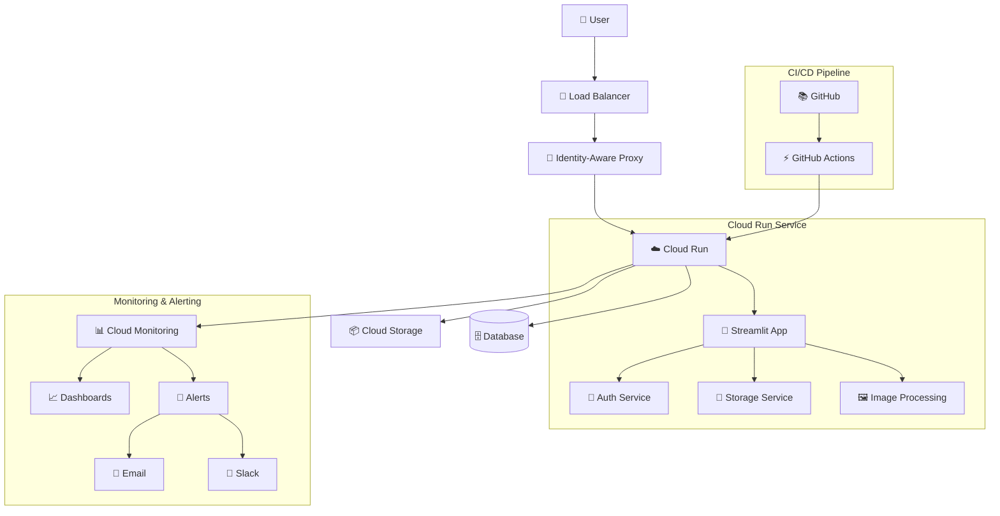
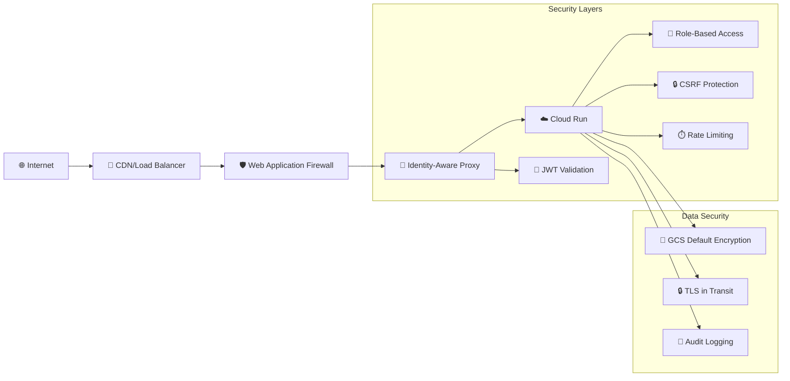

# ImgStream - 写真管理アプリケーション

[](https://github.com/your-org/imgstream/actions)
[](https://github.com/your-org/imgstream/actions)
[](https://github.com/your-org/imgstream/actions)
[](https://opensource.org/licenses/MIT)

ImgStreamは、Python、Streamlit、Google Cloud Platformで構築された現代的なクラウドネイティブ写真管理アプリケーションです。エンタープライズグレードの監視とデプロイメント自動化を備えた、安全な写真のアップロード、保存、管理機能を提供します。

## 🚀 機能

- **安全な写真アップロード・保存**: 自動サムネイル生成付きの写真アップロード
- **クラウドネイティブアーキテクチャ**: 自動スケーリング対応のGoogle Cloud Run構築
- **エンタープライズ認証**: 本番環境向けGoogle Cloud IAP統合
- **リアルタイム監視**: Cloud Monitoringによる包括的なメトリクスとアラート
- **自動化CI/CD**: GitHub Actionsによる自動デプロイメント
- **マルチ環境サポート**: 開発、ステージング、本番環境の設定
- **セキュリティファースト**: 組み込みセキュリティスキャンとコンプライアンスチェック
- **パフォーマンス最適化**: 効率的な画像処理とキャッシング

## 📋 目次

- [クイックスタート](#クイックスタート)
- [アーキテクチャ](#アーキテクチャ)
- [インストール](#インストール)
- [設定](#設定)
- [デプロイメント](#デプロイメント)
- [監視](#監視)
- [開発](#開発)
- [テスト](#テスト)
- [トラブルシューティング](#トラブルシューティング)
- [ライセンス](#ライセンス)

## 🏃‍♂️ クイックスタート

### 前提条件

- Python 3.11+
- Google Cloud Platformアカウント
- Docker（コンテナ化デプロイメント用）
- uvパッケージマネージャー

### ローカル開発環境セットアップ

1. **リポジトリのクローン**
   ```bash
   git clone https://github.com/your-org/imgstream.git
   cd imgstream
   ```

2. **依存関係のインストール**
   ```bash
   # uvがインストールされていない場合はインストール
   curl -LsSf https://astral.sh/uv/install.sh | sh

   # プロジェクトの依存関係をインストール
   uv sync
   ```

3. **環境変数の設定**
   ```bash
   cp .env.example .env
   # .envファイルを設定に合わせて編集
   ```

4. **アプリケーションの実行**
   ```bash
   uv run streamlit run src/imgstream/main.py
   ```

5. **アプリケーションへのアクセス**
   ブラウザで `http://localhost:8501` を開く

## 🏗️ アーキテクチャ

ImgStreamは、スケーラビリティ、セキュリティ、保守性を考慮して設計された現代的なクラウドネイティブアーキテクチャに従っています。

### 高レベルアーキテクチャ



### コンポーネント概要

| コンポーネント | 技術 | 目的 |
|-----------|------------|---------|
| **Webアプリケーション** | Streamlit | Webベースのユーザーインターフェース |
| **ビジネスロジック** | Python Services | 認証、ストレージ、画像処理サービス |
| **認証** | Google Cloud IAP | アイデンティティとアクセス管理 |
| **ストレージ** | Google Cloud Storage | 写真とファイルの保存 |
| **データベース** | DuckDB | メタデータとアプリケーションデータ |
| **コンテナ** | Docker | アプリケーションのコンテナ化 |
| **オーケストレーション** | Cloud Run | サーバーレスコンテナプラットフォーム |
| **CI/CD** | GitHub Actions | 自動デプロイメントパイプライン |
| **監視** | Cloud Monitoring | メトリクス、ログ、アラート |

### セキュリティアーキテクチャ



### セキュリティ実装の詳細

| セキュリティ機能 | 実装方式 | 説明 |
|-----------------|----------|------|
| **認証** | Google Cloud IAP | Identity-Aware Proxyによる認証 |
| **認可** | Role-Based Access | ユーザー別リソースアクセス制御 |
| **通信暗号化** | TLS 1.3 | HTTPS通信の暗号化 |
| **データ暗号化** | GCS Default Encryption | Google管理キーによる自動暗号化 |
| **CSRF保護** | Streamlit Built-in | Cross-Site Request Forgery対策 |
| **レート制限** | Cloud Armor | API呼び出し頻度制限 |
| **監査ログ** | Cloud Logging | 全アクセスログの記録 |

**注意**: 現在、アプリケーションレベルでの独自暗号化は実装されていません。データはGoogle Cloud Storageのデフォルト暗号化（Google管理キー）により保護されています。

## 💻 インストール

### Development Environment

1. **System Requirements**
   - Python 3.11 or higher
   - 4GB RAM minimum (8GB recommended)
   - 10GB free disk space

2. **Install Python Dependencies**
   ```bash
   # Using uv (recommended)
   uv sync

   # Or using pip
   pip install -r requirements.txt
   ```

3. **Install Development Tools**
   ```bash
   # Code formatting and linting
   uv add --dev black ruff mypy

   # Testing tools
   uv add --dev pytest pytest-cov pytest-asyncio
   ```

### Production Environment

See the [Deployment Guide](docs/DEPLOYMENT.md) for detailed production setup instructions.

## ⚙️ Configuration

ImgStream uses environment-specific YAML configuration files located in `config/environments/`:

- `development.yaml` - Local development settings
- `staging.yaml` - Staging environment settings
- `production.yaml` - Production environment settings

### Environment Variables

| Variable | Description | Required | Default |
|----------|-------------|----------|---------|
| `ENVIRONMENT` | Deployment environment | Yes | `development` |
| `GOOGLE_CLOUD_PROJECT` | GCP project ID | Yes | - |
| `GCS_PHOTOS_BUCKET` | Photos storage bucket | Yes | - |
| `GCS_DATABASE_BUCKET` | Database storage bucket | Yes | - |
| `IAP_AUDIENCE` | IAP audience for authentication | Production | - |

### Configuration Example

```yaml
# config/environments/production.yaml
environment: production

app:
  debug: false
  log_level: WARNING
  host: "0.0.0.0"
  port: 8080

auth:
  development_mode: false
  bypass_iap: false
  iap_audience: "${IAP_AUDIENCE}"

storage:
  type: "gcs"
  photos_bucket: "${GCS_PHOTOS_BUCKET}"
  database_bucket: "${GCS_DATABASE_BUCKET}"
  signed_url_expiration: 1800

performance:
  max_file_size: 104857600  # 100MB
  thumbnail_size: [400, 400]
  concurrent_uploads: 20

security:
  csrf_protection: true
  rate_limiting: true
  cors_origins: ["https://imgstream.example.com"]
```

## 🚀 Deployment

ImgStream supports multiple deployment methods:

### 1. GitHub Actions (Recommended)

**重要**: GitHub ActionsではOIDC認証を使用しています。初回設定時は以下を参照してください：
- [GitHub OIDC設定ガイド](docs/GITHUB_OIDC_SETUP.md)
- [Terraform Backend設定](terraform/README.md#backend設定)

Automated deployment triggered by:
- **Staging**: Push to `develop` branch
- **Production**: Push to `main` branch or create release tag

```bash
# Deploy to staging
git push origin develop

# Deploy to production
git tag v1.0.0
git push origin v1.0.0
```

### 2. Manual Deployment

```bash
# Validate configuration
./scripts/validate-deployment-config.sh production

# Deploy to production
ENVIRONMENT=production ./scripts/deploy-cloud-run.sh
```


For detailed deployment instructions, see [Deployment Guide](docs/DEPLOYMENT_GUIDE.md).

## 📊 Monitoring

ImgStream includes comprehensive monitoring and alerting:

### Metrics Dashboard

Access the monitoring dashboard at:
`https://console.cloud.google.com/monitoring/dashboards`

### Key Metrics

- **Request Rate**: Requests per second
- **Error Rate**: Percentage of failed requests
- **Response Time**: 95th percentile latency
- **Resource Usage**: CPU and memory utilization
- **Storage Usage**: GCS bucket utilization

### Alerts

Automatic alerts for:
- Service availability < 99%
- Error rate > 5%
- Response time > 2 seconds
- Resource usage > 80%
- Storage usage > 80GB

### Setup Monitoring

```bash
# Configure monitoring and alerts
ENVIRONMENT=production ./scripts/setup-monitoring.sh
```


## 🛠️ Development

### Development Workflow

1. **Create feature branch**
   ```bash
   git checkout -b feature/new-feature
   ```

2. **Make changes and test**
   ```bash
   # Run tests
   uv run pytest

   # Code formatting
   uv run black .
   uv run ruff check .

   # Type checking
   uv run mypy src/
   ```

3. **Commit and push**
   ```bash
   git add .
   git commit -m "feat: add new feature"
   git push origin feature/new-feature
   ```

4. **Create pull request**
   - Automated tests will run
   - Code review required
   - Merge to `develop` for staging deployment

### Code Quality

The project enforces code quality through automated tools and workflows:

- **Black**: Code formatting and style consistency
- **Ruff**: Fast Python linter for code quality and potential bugs
- **MyPy**: Static type checking for type safety
- **Pytest**: Unit and integration testing

#### Quality Check Workflow

ImgStreamには専用の品質チェックワークフロー（`.github/workflows/quality-check.yml`）が設定されており、以下の場合に自動実行されます：

- **自動トリガー**:
  - `main`または`develop`ブランチへのプッシュ
  - プルリクエストの作成・更新
  - `src/`、`tests/`、設定ファイルの変更時

- **手動実行**:
  ```bash
  # GitHub Actionsで手動実行
  # Repository > Actions > Quality Check > Run workflow
  ```

#### ローカルでの品質チェック実行

開発中にローカルで品質チェックを実行できます：

```bash
# 全ての品質チェックを実行（推奨）
ENVIRONMENT=production uv run pytest
uv run black src/ tests/
uv run ruff check src/ tests/
uv run mypy src/

# または個別に実行
# 1. コードフォーマットチェック
uv run black --check --diff src/ tests/

# 2. リンティング
uv run ruff check src/ tests/

# 3. 型チェック
uv run mypy src/

# 4. 自動修正（可能な場合）
uv run black src/ tests/           # フォーマット修正
uv run ruff check --fix src/ tests/ # 自動修正可能な問題を修正
```

#### 品質チェックの詳細

| ツール | 目的 | 設定ファイル | 実行対象 |
|--------|------|-------------|----------|
| **Black** | コードフォーマット統一 | `pyproject.toml` | `src/`, `tests/` |
| **Ruff** | リンティング・コード品質 | `pyproject.toml` | `src/`, `tests/` |
| **MyPy** | 静的型チェック | `pyproject.toml` | `src/` |

#### 品質チェック設定

品質チェックツールの設定は`pyproject.toml`で管理されています：

```toml
[tool.black]
line-length = 88
target-version = ['py311']
include = '\.pyi?$'

[tool.ruff]
target-version = "py311"
line-length = 88
select = ["E", "F", "W", "C90", "I", "N", "UP", "YTT", "S", "BLE", "FBT", "B", "A", "COM", "C4", "DTZ", "T10", "EM", "EXE", "ISC", "ICN", "G", "INP", "PIE", "T20", "PYI", "PT", "Q", "RSE", "RET", "SLF", "SIM", "TID", "TCH", "ARG", "PTH", "ERA", "PD", "PGH", "PL", "TRY", "NPY", "RUF"]

[tool.mypy]
python_version = "3.11"
strict = true
warn_return_any = true
warn_unused_configs = true
```

#### CI/CDでの品質チェック

品質チェックワークフローは以下の特徴を持ちます：

- **マルチバージョンテスト**: Python 3.11、3.12、3.13での並列実行
- **効率的なキャッシュ**: 依存関係のキャッシュで実行時間短縮
- **詳細なレポート**: 各チェックの結果と修正方法を表示
- **失敗時の詳細情報**: エラーの原因と解決方法を提示

#### 品質チェック失敗時の対処

品質チェックが失敗した場合の対処方法：

1. **Black（フォーマット）エラー**:
   ```bash
   # 自動修正
   uv run black src/ tests/
   ```

2. **Ruff（リンティング）エラー**:
   ```bash
   # 自動修正可能な問題を修正
   uv run ruff check --fix src/ tests/

   # 手動修正が必要な問題を確認
   uv run ruff check src/ tests/
   ```

3. **MyPy（型チェック）エラー**:
   ```bash
   # 詳細なエラー情報を確認
   uv run mypy src/ --show-error-codes

   # 型アノテーションを追加または修正
   ```

### Pre-commit Hooks

開発効率を向上させるため、pre-commitフックを設定できます：

```bash
uv add --dev pre-commit
uv run pre-commit install

# 全ファイルに対してフックを実行
uv run pre-commit run --all-files
```

## 🧪 Testing

### Test Structure

```
tests/
├── unit/           # Unit tests
├── integration/    # Integration tests
├── e2e/           # End-to-end tests
├── security/      # Security tests
└── performance/   # Performance tests
```

### Running Tests

```bash
# All tests
uv run pytest

# Unit tests only
uv run pytest tests/unit/

# With coverage
uv run pytest --cov=src/imgstream --cov-report=html

# Security tests
ENVIRONMENT=production uv run pytest tests/security/

# Performance tests
uv run pytest tests/performance/
```

### Test Configuration

Tests use environment-specific configuration:

```bash
# Test with staging configuration
ENVIRONMENT=staging uv run pytest tests/integration/

# Test with production configuration
ENVIRONMENT=production uv run pytest tests/security/
```

## 🔧 Troubleshooting

### Common Issues

#### 1. Authentication Errors

**Problem**: `401 Unauthorized` errors in production

**Solution**:
```bash
# Check IAP configuration
gcloud iap web get-iam-policy --resource-type=backend-services \
  --service=imgstream-production

# Verify service account permissions
gcloud projects get-iam-policy $GOOGLE_CLOUD_PROJECT
```

#### 2. Storage Issues

**Problem**: Cannot upload files or access storage

**Solution**:
```bash
# Check bucket permissions
gsutil iam get gs://your-bucket-name

# Test bucket access
gsutil ls gs://your-bucket-name

# Check OIDC authentication (GitHub Actions)
# OIDC認証では長期間有効なキーファイルは不要
# 認証はWorkload Identity Federationで自動処理
```

#### 3. Deployment Failures

**Problem**: Cloud Run deployment fails

**Solution**:
```bash
# Check GitHub Actions logs
# Visit: https://github.com/your-org/imgstream/actions

# Validate configuration
./scripts/validate-deployment-config.sh production

# Check service logs
gcloud logs read "resource.type=cloud_run_revision" --limit=50
```

#### 4. Performance Issues

**Problem**: Slow response times or high resource usage

**Solution**:
```bash
# Check monitoring dashboard
# https://console.cloud.google.com/monitoring

# Analyze performance metrics
./scripts/deployment-monitor.sh status

# Review resource allocation
gcloud run services describe imgstream-production --region=us-central1
```

### Getting Help

1. **Check the logs**:
   ```bash
   gcloud logs read "resource.type=cloud_run_revision" --limit=100
   ```

2. **Review monitoring dashboard**:
   Visit Cloud Console > Monitoring > Dashboards

3. **Run health checks**:
   ```bash
   curl https://your-app-url/health
   ```

4. **Contact support**:
   - Create an issue in the GitHub repository
   - Check existing documentation in `docs/`
   - Review troubleshooting guide in `docs/TROUBLESHOOTING.md`


## 📄 License

This project is licensed under the MIT License - see the [LICENSE](LICENSE) file for details.

---

**ImgStream** - Modern photo management for the cloud era 📸☁️


---
ref. https://zenn.dev/gluc0se/articles/ccb48b0168dbc7
