# ImgStream - Photo Management Application

[](https://github.com/your-org/imgstream/actions)
[](https://github.com/your-org/imgstream/actions)
[](https://opensource.org/licenses/MIT)

ImgStream is a modern, cloud-native photo management application built with Python, Streamlit, and Google Cloud Platform. It provides secure photo upload, storage, and management capabilities with enterprise-grade monitoring and deployment automation.

## 🚀 Features

- **Secure Photo Upload & Storage**: Upload photos with automatic thumbnail generation
- **Cloud-Native Architecture**: Built for Google Cloud Run with auto-scaling
- **Enterprise Authentication**: Google Cloud IAP integration for production
- **Real-time Monitoring**: Comprehensive metrics and alerting with Cloud Monitoring
- **Automated CI/CD**: GitHub Actions and Cloud Build integration
- **Multi-Environment Support**: Development, staging, and production configurations
- **Security First**: Built-in security scanning and compliance checks
- **Performance Optimized**: Efficient image processing and caching

## 📋 Table of Contents

- [Quick Start](#quick-start)
- [Architecture](#architecture)
- [Installation](#installation)
- [Configuration](#configuration)
- [Deployment](#deployment)
- [Monitoring](#monitoring)
- [API Documentation](#api-documentation)
- [Development](#development)
- [Testing](#testing)
- [Troubleshooting](#troubleshooting)
- [Contributing](#contributing)
- [License](#license)

## 🏃‍♂️ Quick Start

### Prerequisites

- Python 3.11+
- Google Cloud Platform account
- Docker (for containerized deployment)
- uv package manager

### Local Development Setup

1. **Clone the repository**
   ```bash
   git clone https://github.com/your-org/imgstream.git
   cd imgstream
   ```

2. **Install dependencies**
   ```bash
   # Install uv if not already installed
   curl -LsSf https://astral.sh/uv/install.sh | sh
   
   # Install project dependencies
   uv sync
   ```

3. **Set up environment variables**
   ```bash
   cp .env.example .env
   # Edit .env with your configuration
   ```

4. **Run the application**
   ```bash
   uv run streamlit run src/imgstream/main.py
   ```

5. **Access the application**
   Open your browser to `http://localhost:8501`

## 🏗️ Architecture

ImgStream follows a modern cloud-native architecture designed for scalability, security, and maintainability.

### High-Level Architecture

```mermaid
graph TB
    User[👤 User] --> LB[🔄 Load Balancer]
    LB --> IAP[🔐 Identity-Aware Proxy]
    IAP --> CR[☁️ Cloud Run]
    CR --> GCS[📦 Cloud Storage]
    CR --> DB[(🗄️ Database)]
    CR --> MON[📊 Cloud Monitoring]
    
    subgraph "Cloud Run Service"
        CR --> APP[📱 Streamlit App]
        APP --> AUTH[🔑 Auth Service]
        APP --> STORAGE[💾 Storage Service]
        APP --> IMG[🖼️ Image Processing]
    end
    
    subgraph "CI/CD Pipeline"
        GH[📚 GitHub] --> GA[⚡ GitHub Actions]
        GA --> CB[🔨 Cloud Build]
        CB --> GCR[📦 Container Registry]
        GCR --> CR
    end
    
    subgraph "Monitoring & Alerting"
        MON --> DASH[📈 Dashboards]
        MON --> ALERT[🚨 Alerts]
        ALERT --> EMAIL[📧 Email]
        ALERT --> SLACK[💬 Slack]
    end
```



### Component Overview

| Component | Technology | Purpose |
|-----------|------------|---------|
| **Frontend** | Streamlit | Web-based user interface |
| **Backend** | Python/FastAPI | API services and business logic |
| **Authentication** | Google Cloud IAP | Identity and access management |
| **Storage** | Google Cloud Storage | Photo and file storage |
| **Database** | DuckDB | Metadata and application data |
| **Container** | Docker | Application containerization |
| **Orchestration** | Cloud Run | Serverless container platform |
| **CI/CD** | GitHub Actions + Cloud Build | Automated deployment pipeline |
| **Monitoring** | Cloud Monitoring | Metrics, logging, and alerting |

### Security Architecture

```mermaid
graph LR
    Internet[🌐 Internet] --> CDN[🔄 CDN/Load Balancer]
    CDN --> WAF[🛡️ Web Application Firewall]
    WAF --> IAP[🔐 Identity-Aware Proxy]
    IAP --> CR[☁️ Cloud Run]
    
    subgraph "Security Layers"
        IAP --> JWT[🎫 JWT Validation]
        CR --> RBAC[👥 Role-Based Access]
        CR --> CSRF[🔒 CSRF Protection]
        CR --> RATE[⏱️ Rate Limiting]
    end
    
    subgraph "Data Security"
        CR --> ENC[🔐 Encryption at Rest]
        CR --> TLS[🔒 TLS in Transit]
        CR --> AUDIT[📝 Audit Logging]
    end
```



## 💻 Installation

### Development Environment

1. **System Requirements**
   - Python 3.11 or higher
   - 4GB RAM minimum (8GB recommended)
   - 10GB free disk space

2. **Install Python Dependencies**
   ```bash
   # Using uv (recommended)
   uv sync
   
   # Or using pip
   pip install -r requirements.txt
   ```

3. **Install Development Tools**
   ```bash
   # Code formatting and linting
   uv add --dev black ruff mypy
   
   # Testing tools
   uv add --dev pytest pytest-cov pytest-asyncio
   ```

### Production Environment

See the [Deployment Guide](docs/DEPLOYMENT.md) for detailed production setup instructions.

## ⚙️ Configuration

ImgStream uses environment-specific YAML configuration files located in `config/environments/`:

- `development.yaml` - Local development settings
- `staging.yaml` - Staging environment settings
- `production.yaml` - Production environment settings

### Environment Variables

| Variable | Description | Required | Default |
|----------|-------------|----------|---------|
| `ENVIRONMENT` | Deployment environment | Yes | `development` |
| `GOOGLE_CLOUD_PROJECT` | GCP project ID | Yes | - |
| `GCS_BUCKET_*` | Storage bucket per environment | Yes | - |
| `IAP_AUDIENCE` | IAP audience for authentication | Production | - |

### Configuration Example

```yaml
# config/environments/production.yaml
environment: production

app:
  debug: false
  log_level: WARNING
  host: "0.0.0.0"
  port: 8080

auth:
  development_mode: false
  bypass_iap: false
  iap_audience: "${IAP_AUDIENCE}"

storage:
  type: "gcs"
  gcs_bucket: "${GCS_BUCKET_PRODUCTION}"
  signed_url_expiration: 1800

performance:
  max_file_size: 104857600  # 100MB
  thumbnail_size: [400, 400]
  concurrent_uploads: 20

security:
  csrf_protection: true
  rate_limiting: true
  cors_origins: ["https://imgstream.example.com"]
```

## 🚀 Deployment

ImgStream supports multiple deployment methods:

### 1. GitHub Actions (Recommended)

Automated deployment triggered by:
- **Staging**: Push to `develop` branch
- **Production**: Push to `main` branch or create release tag

```bash
# Deploy to staging
git push origin develop

# Deploy to production
git tag v1.0.0
git push origin v1.0.0
```

### 2. Manual Deployment

```bash
# Validate configuration
./scripts/validate-deployment-config.sh production

# Deploy to production
ENVIRONMENT=production ./scripts/deploy-cloud-run.sh
```

### 3. Cloud Build

```bash
# Deploy using Cloud Build
gcloud builds submit --config cloudbuild.yaml \
  --substitutions _ENVIRONMENT=production
```

For detailed deployment instructions, see [Deployment Guide](docs/DEPLOYMENT.md).

## 📊 Monitoring

ImgStream includes comprehensive monitoring and alerting:

### Metrics Dashboard

Access the monitoring dashboard at:
`https://console.cloud.google.com/monitoring/dashboards`

### Key Metrics

- **Request Rate**: Requests per second
- **Error Rate**: Percentage of failed requests
- **Response Time**: 95th percentile latency
- **Resource Usage**: CPU and memory utilization
- **Storage Usage**: GCS bucket utilization

### Alerts

Automatic alerts for:
- Service availability < 99%
- Error rate > 5%
- Response time > 2 seconds
- Resource usage > 80%
- Storage usage > 80GB

### Setup Monitoring

```bash
# Configure monitoring and alerts
ENVIRONMENT=production ./scripts/setup-monitoring.sh
```

## 📚 API Documentation

### Health Check Endpoints

| Endpoint | Method | Description |
|----------|--------|-------------|
| `/health` | GET | Comprehensive health check |
| `/health?format=json` | GET | Health status in JSON format |
| `/ready` | GET | Readiness probe for Kubernetes |

### Photo Management Endpoints

| Endpoint | Method | Description |
|----------|--------|-------------|
| `/upload` | POST | Upload photo with metadata |
| `/photos` | GET | List user's photos |
| `/photos/{id}` | GET | Get photo details |
| `/photos/{id}` | DELETE | Delete photo |
| `/photos/{id}/thumbnail` | GET | Get photo thumbnail |

### Authentication

All API endpoints require authentication:

- **Development**: No authentication required
- **Staging/Production**: Google Cloud IAP authentication

Example authenticated request:
```bash
curl -H "Authorization: Bearer $IAP_TOKEN" \
     https://imgstream.example.com/api/photos
```

## 🛠️ Development

### Development Workflow

1. **Create feature branch**
   ```bash
   git checkout -b feature/new-feature
   ```

2. **Make changes and test**
   ```bash
   # Run tests
   uv run pytest
   
   # Code formatting
   uv run black .
   uv run ruff check .
   
   # Type checking
   uv run mypy src/
   ```

3. **Commit and push**
   ```bash
   git add .
   git commit -m "feat: add new feature"
   git push origin feature/new-feature
   ```

4. **Create pull request**
   - Automated tests will run
   - Code review required
   - Merge to `develop` for staging deployment

### Code Quality

The project enforces code quality through:

- **Black**: Code formatting
- **Ruff**: Fast Python linter
- **MyPy**: Static type checking
- **Pytest**: Unit and integration testing

### Pre-commit Hooks

Install pre-commit hooks for automatic code quality checks:

```bash
uv add --dev pre-commit
uv run pre-commit install
```

## 🧪 Testing

### Test Structure

```
tests/
├── unit/           # Unit tests
├── integration/    # Integration tests
├── e2e/           # End-to-end tests
├── security/      # Security tests
└── performance/   # Performance tests
```

### Running Tests

```bash
# All tests
uv run pytest

# Unit tests only
uv run pytest tests/unit/

# With coverage
uv run pytest --cov=src/imgstream --cov-report=html

# Security tests
ENVIRONMENT=production uv run pytest tests/security/

# Performance tests
uv run pytest tests/performance/
```

### Test Configuration

Tests use environment-specific configuration:

```bash
# Test with staging configuration
ENVIRONMENT=staging uv run pytest tests/integration/

# Test with production configuration
ENVIRONMENT=production uv run pytest tests/security/
```

## 🔧 Troubleshooting

### Common Issues

#### 1. Authentication Errors

**Problem**: `401 Unauthorized` errors in production

**Solution**:
```bash
# Check IAP configuration
gcloud iap web get-iam-policy --resource-type=backend-services \
  --service=imgstream-production

# Verify service account permissions
gcloud projects get-iam-policy $GOOGLE_CLOUD_PROJECT
```

#### 2. Storage Issues

**Problem**: Cannot upload files or access storage

**Solution**:
```bash
# Check bucket permissions
gsutil iam get gs://your-bucket-name

# Test bucket access
gsutil ls gs://your-bucket-name

# Check service account key
gcloud auth activate-service-account --key-file=service-account-key.json
```

#### 3. Deployment Failures

**Problem**: Cloud Run deployment fails

**Solution**:
```bash
# Check build logs
gcloud builds log [BUILD_ID]

# Validate configuration
./scripts/validate-deployment-config.sh production

# Check service logs
gcloud logs read "resource.type=cloud_run_revision" --limit=50
```

#### 4. Performance Issues

**Problem**: Slow response times or high resource usage

**Solution**:
```bash
# Check monitoring dashboard
# https://console.cloud.google.com/monitoring

# Analyze performance metrics
./scripts/deployment-monitor.sh status

# Review resource allocation
gcloud run services describe imgstream-production --region=us-central1
```

### Getting Help

1. **Check the logs**:
   ```bash
   gcloud logs read "resource.type=cloud_run_revision" --limit=100
   ```

2. **Review monitoring dashboard**:
   Visit Cloud Console > Monitoring > Dashboards

3. **Run health checks**:
   ```bash
   curl https://your-app-url/health
   ```

4. **Contact support**:
   - Create an issue in the GitHub repository
   - Check existing documentation in `docs/`
   - Review troubleshooting guide in `docs/TROUBLESHOOTING.md`

## 🤝 Contributing

We welcome contributions! Please see our [Contributing Guide](CONTRIBUTING.md) for details.

### Development Setup

1. Fork the repository
2. Create a feature branch
3. Make your changes
4. Add tests for new functionality
5. Ensure all tests pass
6. Submit a pull request

### Code Standards

- Follow PEP 8 style guidelines
- Add type hints to all functions
- Write comprehensive tests
- Update documentation for new features
- Use conventional commit messages

## 📄 License

This project is licensed under the MIT License - see the [LICENSE](LICENSE) file for details.

## 🙏 Acknowledgments

- [Streamlit](https://streamlit.io/) for the web framework
- [Google Cloud Platform](https://cloud.google.com/) for cloud infrastructure
- [FastAPI](https://fastapi.tiangolo.com/) for API framework
- [DuckDB](https://duckdb.org/) for embedded analytics

## 📞 Support

- **Documentation**: [docs/](docs/)
- **Issues**: [GitHub Issues](https://github.com/your-org/imgstream/issues)
- **Discussions**: [GitHub Discussions](https://github.com/your-org/imgstream/discussions)
- **Security**: Report security issues to security@example.com

---

**ImgStream** - Modern photo management for the cloud era 📸☁️
