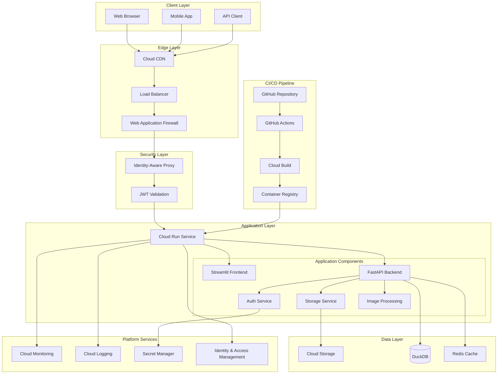
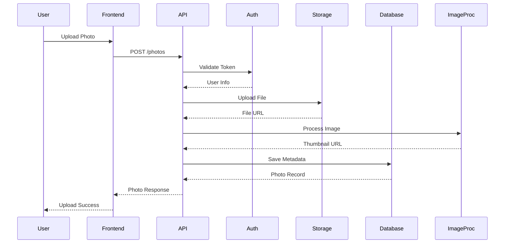
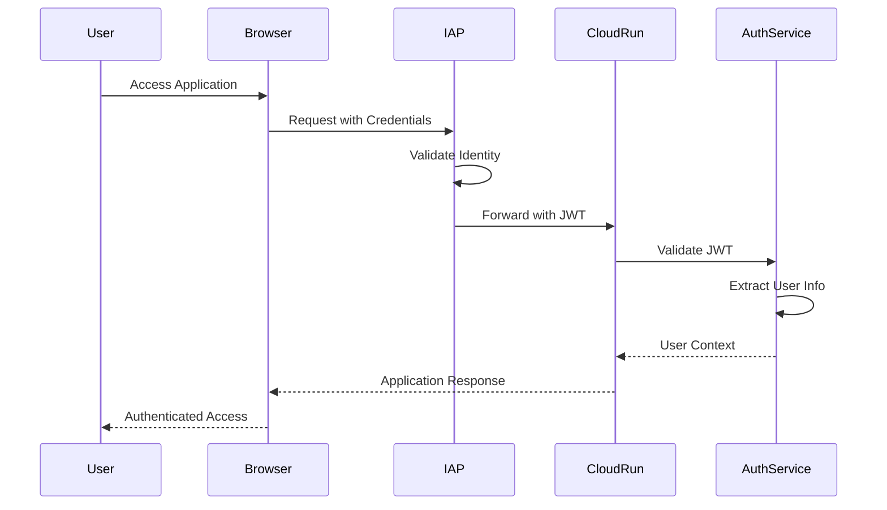
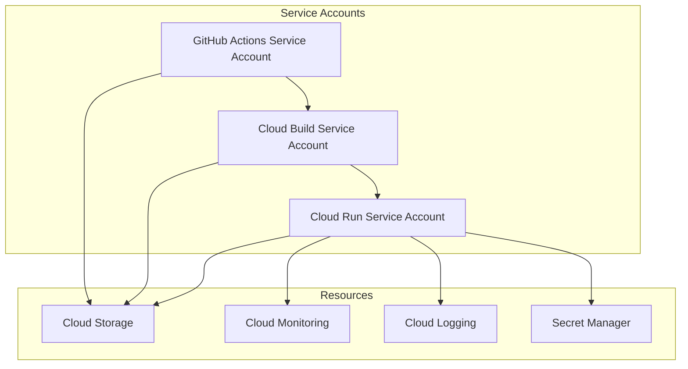
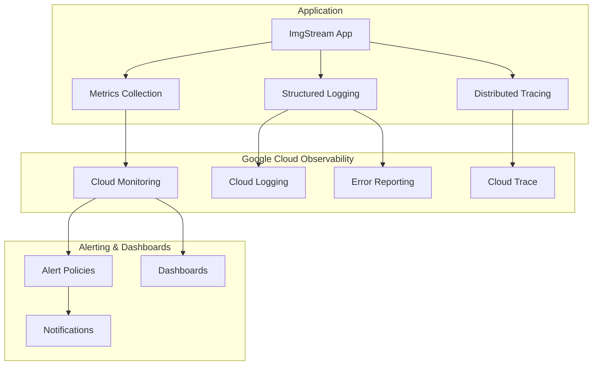

# ImgStream アーキテクチャドキュメント

このドキュメントは、システム設計、コンポーネント間の相互作用、データフロー、デプロイメントパターンを含む、ImgStream 写真管理アプリケーションのアーキテクチャの包括的な概要を提供します。

## 📋 目次

- [システム概要](#システム概要)
- [アーキテクチャ原則](#アーキテクチャ原則)
- [高レベルアーキテクチャ](#高レベルアーキテクチャ)
- [コンポーネントアーキテクチャ](#コンポーネントアーキテクチャ)
- [データアーキテクチャ](#データアーキテクチャ)
- [セキュリティアーキテクチャ](#セキュリティアーキテクチャ)
- [デプロイメントアーキテクチャ](#デプロイメントアーキテクチャ)
- [監視アーキテクチャ](#監視アーキテクチャ)
- [スケーラビリティの考慮事項](#スケーラビリティの考慮事項)
- [技術スタック](#技術スタック)

## 🌐 システム概要

ImgStream は、スケーラビリティ、セキュリティ、保守性を考慮して設計されたクラウドネイティブ写真管理アプリケーションです。システムは、サーバーレスコンピューティングとマネージドサービスに焦点を当てたマイクロサービス原則に従っています。

### 主要特性

- **クラウドネイティブ**: サーバーレスアーキテクチャで Google Cloud Platform 向けに構築
- **スケーラブル**: 固定インフラなしで需要に基づく自動スケーリング
- **セキュア**: IAP と包括的監視によるエンタープライズグレードセキュリティ
- **レジリエント**: 自動復旧メカニズムを備えた耐障害性設計
- **観測可能**: 包括的な監視、ログ、アラート

### 設計目標

1. **シンプルさ**: 機能を維持しながら複雑さを最小化
2. **パフォーマンス**: 一般的な操作で 1 秒未満の応答時間
3. **信頼性**: 自動フェイルオーバーで 99.9%の稼働時間
4. **セキュリティ**: 多層防御によるゼロトラストセキュリティモデル
5. **コスト効率**: 効率的なリソース利用による従量課金モデル

## 🏗️ Architecture Principles

### 1. Serverless-First

- Prefer managed services over self-managed infrastructure
- Use Cloud Run for containerized workloads
- Leverage Cloud Functions for event-driven processing
- Minimize operational overhead

### 2. API-Driven Design

- RESTful API design with OpenAPI specifications
- Consistent error handling and response formats
- Versioned APIs for backward compatibility
- Comprehensive API documentation

### 3. Security by Design

- Zero-trust security model
- Identity-Aware Proxy for authentication
- Encryption at rest and in transit
- Principle of least privilege for service accounts

### 4. Observability

- Structured logging with correlation IDs
- Comprehensive metrics collection
- Distributed tracing for request flows
- Proactive alerting and monitoring

### 5. Infrastructure as Code

- Terraform for infrastructure provisioning
- GitOps for deployment automation
- Environment parity across dev/staging/production
- Immutable infrastructure patterns

## 🏛️ High-Level Architecture



## 🔧 Component Architecture

### Frontend Components

#### Streamlit Application

- **Purpose**: Web-based user interface
- **Technology**: Python Streamlit framework
- **Responsibilities**:
  - User interface rendering
  - File upload handling
  - Authentication integration
  - Real-time updates

```python
# Streamlit App Structure
src/imgstream/
├── main.py              # Main application entry point
├── pages/               # Page components
│   ├── upload.py       # Photo upload page
│   ├── gallery.py      # Photo gallery page
│   └── profile.py      # User profile page
├── components/          # Reusable UI components
│   ├── auth.py         # Authentication components
│   ├── upload.py       # Upload components
│   └── gallery.py      # Gallery components
└── utils/              # Utility functions
    ├── session.py      # Session management
    └── helpers.py      # Helper functions
```

### Backend Components

#### API Service Layer

- **Purpose**: RESTful API endpoints
- **Technology**: FastAPI framework
- **Responsibilities**:
  - Request/response handling
  - Business logic orchestration
  - Data validation
  - Error handling

```python
# API Service Structure
src/imgstream/api/
├── main.py             # FastAPI application
├── routers/            # API route handlers
│   ├── photos.py       # Photo management endpoints
│   ├── users.py        # User management endpoints
│   └── health.py       # Health check endpoints
├── models/             # Pydantic data models
│   ├── photo.py        # Photo data models
│   └── user.py         # User data models
├── services/           # Business logic services
│   ├── photo_service.py
│   └── user_service.py
└── middleware/         # Custom middleware
    ├── auth.py         # Authentication middleware
    └── logging.py      # Logging middleware
```

#### Core Services

##### Authentication Service

```python
class AuthService:
    """Handles user authentication and authorization."""

    def validate_iap_token(self, token: str) -> User:
        """Validate IAP JWT token and extract user info."""

    def get_current_user(self, request: Request) -> User:
        """Get current authenticated user."""

    def check_permissions(self, user: User, resource: str, action: str) -> bool:
        """Check user permissions for resource access."""
```

##### Storage Service

```python
class StorageService:
    """Handles file storage operations."""

    def upload_file(self, file: UploadFile, user_id: str) -> StorageResult:
        """Upload file to cloud storage."""

    def generate_signed_url(self, file_path: str, expiration: int) -> str:
        """Generate signed URL for file access."""

    def delete_file(self, file_path: str) -> bool:
        """Delete file from storage."""
```

##### Image Processing Service

```python
class ImageProcessingService:
    """Handles image processing operations."""

    def generate_thumbnail(self, image_path: str, size: tuple) -> str:
        """Generate thumbnail for image."""

    def extract_metadata(self, image_path: str) -> dict:
        """Extract EXIF metadata from image."""

    def optimize_image(self, image_path: str, quality: int) -> str:
        """Optimize image for web delivery."""
```

### Data Access Layer

#### Database Service

```python
class DatabaseService:
    """Handles database operations."""

    def __init__(self):
        self.connection = duckdb.connect(config.database.path)

    def create_photo(self, photo_data: PhotoCreate) -> Photo:
        """Create new photo record."""

    def get_photos(self, user_id: str, filters: PhotoFilters) -> List[Photo]:
        """Get user's photos with filtering."""

    def update_photo(self, photo_id: str, updates: PhotoUpdate) -> Photo:
        """Update photo metadata."""
```

## 💾 Data Architecture

### Data Flow



### Data Models

#### Photo Entity

```sql
CREATE TABLE photos (
    id VARCHAR PRIMARY KEY,
    user_id VARCHAR NOT NULL,
    title VARCHAR(255),
    description TEXT,
    filename VARCHAR(255) NOT NULL,
    content_type VARCHAR(100) NOT NULL,
    size_bytes BIGINT NOT NULL,
    width INTEGER,
    height INTEGER,
    tags VARCHAR[],
    private BOOLEAN DEFAULT FALSE,
    upload_date TIMESTAMP DEFAULT CURRENT_TIMESTAMP,
    updated_date TIMESTAMP DEFAULT CURRENT_TIMESTAMP,
    storage_path VARCHAR(500) NOT NULL,
    thumbnail_path VARCHAR(500),
    metadata JSON
);
```

#### User Entity

```sql
CREATE TABLE users (
    id VARCHAR PRIMARY KEY,
    email VARCHAR(255) UNIQUE NOT NULL,
    name VARCHAR(255),
    avatar_url VARCHAR(500),
    created_date TIMESTAMP DEFAULT CURRENT_TIMESTAMP,
    last_login TIMESTAMP,
    settings JSON,
    storage_quota BIGINT DEFAULT 1073741824, -- 1GB
    storage_used BIGINT DEFAULT 0
);
```

### Storage Strategy

#### File Storage (Google Cloud Storage)

```
gs://imgstream-{environment}-bucket/
├── photos/
│   ├── {user_id}/
│   │   ├── {photo_id}.{ext}
│   │   └── ...
│   └── ...
├── thumbnails/
│   ├── {user_id}/
│   │   ├── {photo_id}_thumb.{ext}
│   │   └── ...
│   └── ...
└── temp/
    ├── uploads/
    └── processing/
```

#### Database Storage (DuckDB)

- **Metadata Storage**: Photo metadata, user information, relationships
- **Analytics**: Usage statistics, performance metrics
- **Configuration**: Application settings, feature flags

## 🔒 Security Architecture

### Authentication Flow



### Security Layers

#### 1. Network Security

- **Cloud CDN**: DDoS protection and edge caching
- **Load Balancer**: SSL termination and traffic distribution
- **VPC**: Network isolation and firewall rules

#### 2. Application Security

- **Identity-Aware Proxy**: User authentication and authorization
- **JWT Validation**: Token-based security
- **CSRF Protection**: Cross-site request forgery prevention
- **Rate Limiting**: API abuse prevention

#### 3. Data Security

- **Encryption at Rest**: All data encrypted in storage
- **Encryption in Transit**: TLS 1.3 for all communications
- **Access Controls**: Fine-grained permissions
- **Audit Logging**: Comprehensive security event logging

### Service Account Architecture



## 🚀 Deployment Architecture

### Multi-Environment Strategy

```mermaid
graph LR
    subgraph "Development"
        DEV_CODE[Code Changes]
        DEV_TEST[Local Testing]
        DEV_ENV[Dev Environment]
    end

    subgraph "Staging"
        STAGE_DEPLOY[Auto Deploy]
        STAGE_TEST[Integration Tests]
        STAGE_ENV[Staging Environment]
    end

    subgraph "Production"
        PROD_APPROVE[Manual Approval]
        PROD_DEPLOY[Production Deploy]
        PROD_ENV[Production Environment]
    end

    DEV_CODE --> DEV_TEST
    DEV_TEST --> DEV_ENV
    DEV_ENV --> STAGE_DEPLOY
    STAGE_DEPLOY --> STAGE_TEST
    STAGE_TEST --> STAGE_ENV
    STAGE_ENV --> PROD_APPROVE
    PROD_APPROVE --> PROD_DEPLOY
    PROD_DEPLOY --> PROD_ENV
```



### Container Architecture

```dockerfile
# Multi-stage build for optimized container
FROM python:3.11-slim as builder
WORKDIR /app
COPY requirements.txt .
RUN pip install --no-cache-dir -r requirements.txt

FROM python:3.11-slim as runtime
WORKDIR /app
COPY --from=builder /usr/local/lib/python3.11/site-packages /usr/local/lib/python3.11/site-packages
COPY src/ ./src/
COPY config/ ./config/

EXPOSE 8080
CMD ["python", "-m", "streamlit", "run", "src/imgstream/main.py", "--server.port=8080"]
```

### Infrastructure as Code

```hcl
# Terraform configuration structure
terraform/
├── main.tf              # Main configuration
├── variables.tf         # Input variables
├── outputs.tf          # Output values
├── modules/            # Reusable modules
│   ├── cloud-run/     # Cloud Run module
│   ├── storage/       # Storage module
│   └── monitoring/    # Monitoring module
└── environments/      # Environment-specific configs
    ├── development/
    ├── staging/
    └── production/
```

## 📊 Monitoring Architecture

### Observability Stack



### Metrics Collection

#### Application Metrics

- Request rate and response times
- Error rates and types
- Business metrics (uploads, users)
- Resource utilization

#### Infrastructure Metrics

- Container CPU and memory usage
- Storage utilization
- Network throughput
- Database performance

#### Custom Metrics

```python
from src.imgstream.monitoring import get_metrics_collector

metrics = get_metrics_collector()

# Business metrics
metrics.record_business_metric("photo_uploads", 1, {"user_type": "premium"})

# Performance metrics
with metrics.time_operation("image_processing"):
    process_image(image_data)

# Error tracking
metrics.record_error("storage_error", {"operation": "upload"})
```

## 📈 Scalability Considerations

### Horizontal Scaling

#### Auto-scaling Configuration

```yaml
# Cloud Run scaling configuration
spec:
  template:
    metadata:
      annotations:
        autoscaling.knative.dev/minScale: "1"
        autoscaling.knative.dev/maxScale: "100"
        autoscaling.knative.dev/target: "70"
    spec:
      containerConcurrency: 100
      timeoutSeconds: 300
```

#### Performance Optimization

- **Connection Pooling**: Efficient database connections
- **Caching Strategy**: Redis for frequently accessed data
- **CDN Integration**: Edge caching for static assets
- **Image Optimization**: Automatic compression and format conversion

### Vertical Scaling

#### Resource Allocation

```yaml
# Environment-specific resource limits
development:
  cpu: "1"
  memory: "512Mi"

staging:
  cpu: "1"
  memory: "1Gi"

production:
  cpu: "2"
  memory: "2Gi"
```

### Data Scaling

#### Storage Strategy

- **Partitioning**: User-based data partitioning
- **Archiving**: Automated data lifecycle management
- **Backup**: Regular automated backups
- **Replication**: Multi-region data replication

## 🛠️ Technology Stack

### Core Technologies

| Layer         | Technology           | Purpose                      |
| ------------- | -------------------- | ---------------------------- |
| **Frontend**  | Streamlit            | Web application framework    |
| **Backend**   | FastAPI              | REST API framework           |
| **Language**  | Python 3.11          | Primary programming language |
| **Database**  | DuckDB               | Embedded analytics database  |
| **Storage**   | Google Cloud Storage | Object storage               |
| **Container** | Docker               | Application containerization |

### Cloud Platform

| Service                  | Purpose                       |
| ------------------------ | ----------------------------- |
| **Cloud Run**            | Serverless container platform |
| **Cloud Build**          | CI/CD pipeline                |
| **Cloud Storage**        | File storage                  |
| **Cloud Monitoring**     | Observability                 |
| **Cloud Logging**        | Log management                |
| **Identity-Aware Proxy** | Authentication                |
| **Secret Manager**       | Secrets management            |

### Development Tools

| Tool          | Purpose                   |
| ------------- | ------------------------- |
| **uv**        | Python package management |
| **Black**     | Code formatting           |
| **Ruff**      | Python linting            |
| **MyPy**      | Static type checking      |
| **Pytest**    | Testing framework         |
| **Terraform** | Infrastructure as Code    |

### Monitoring & Observability

| Tool                  | Purpose                |
| --------------------- | ---------------------- |
| **Cloud Monitoring**  | Metrics and alerting   |
| **Cloud Logging**     | Centralized logging    |
| **Cloud Trace**       | Distributed tracing    |
| **Error Reporting**   | Error tracking         |
| **Custom Dashboards** | Operational visibility |

## 🔄 Future Architecture Considerations

### Microservices Evolution

- **Service Decomposition**: Split into focused microservices
- **Event-Driven Architecture**: Implement event sourcing
- **API Gateway**: Centralized API management
- **Service Mesh**: Advanced traffic management

### Advanced Features

- **Machine Learning**: Automated image tagging and search
- **Real-time Processing**: WebSocket support for live updates
- **Multi-tenancy**: Support for multiple organizations
- **Global Distribution**: Multi-region deployment

### Technology Upgrades

- **Kubernetes**: Migration to GKE for advanced orchestration
- **GraphQL**: Enhanced API flexibility
- **Streaming**: Real-time data processing
- **Edge Computing**: Closer data processing to users

---

This architecture documentation serves as a living document that evolves with the system. Regular reviews and updates ensure it remains accurate and useful for development and operations teams.
