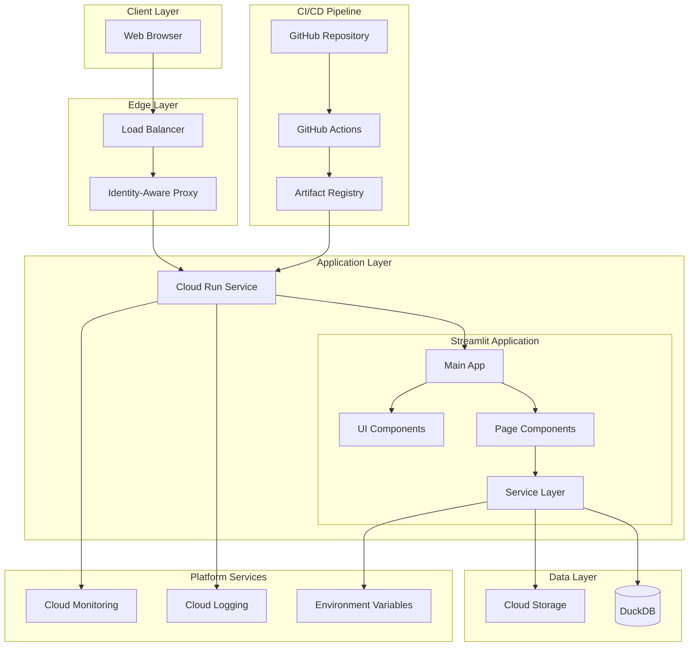
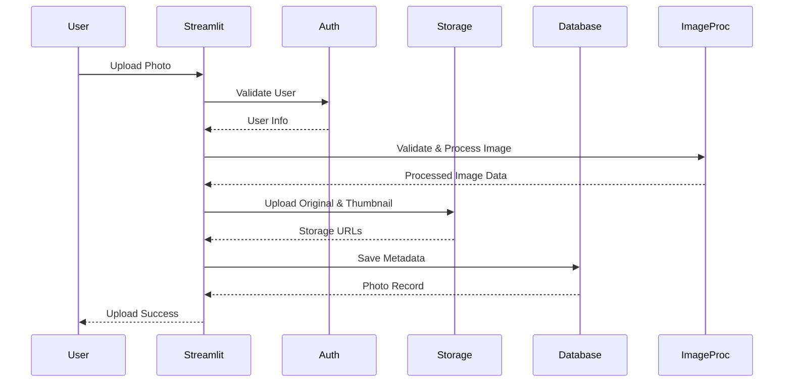
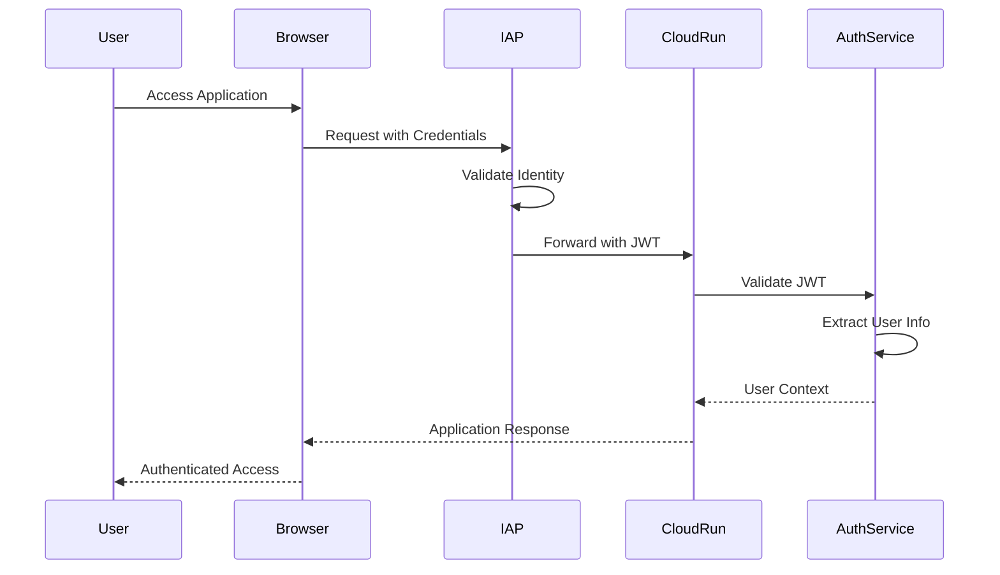
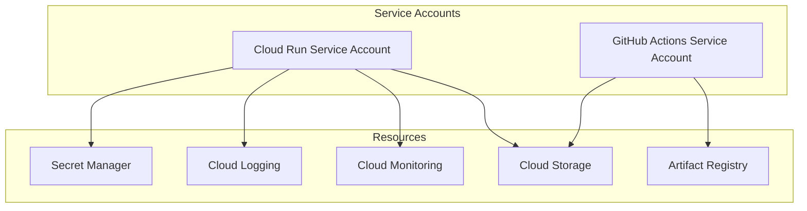
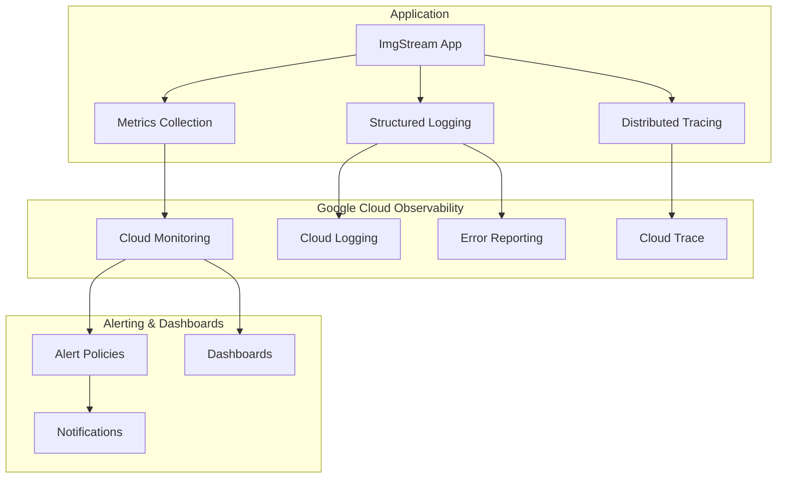

# ImgStream アーキテクチャドキュメント

このドキュメントは、システム設計、コンポーネント間の相互作用、データフロー、デプロイメントパターンを含む、ImgStream 写真管理アプリケーションのアーキテクチャの包括的な概要を提供します。

## 📋 目次

- [システム概要](#システム概要)
- [アーキテクチャ原則](#アーキテクチャ原則)
- [高レベルアーキテクチャ](#高レベルアーキテクチャ)
- [コンポーネントアーキテクチャ](#コンポーネントアーキテクチャ)
- [データアーキテクチャ](#データアーキテクチャ)
- [セキュリティアーキテクチャ](#セキュリティアーキテクチャ)
- [デプロイメントアーキテクチャ](#デプロイメントアーキテクチャ)
- [監視アーキテクチャ](#監視アーキテクチャ)
- [スケーラビリティの考慮事項](#スケーラビリティの考慮事項)
- [技術スタック](#技術スタック)

## 🌐 システム概要

ImgStream は、スケーラビリティ、セキュリティ、保守性を考慮して設計されたクラウドネイティブ写真管理アプリケーションです。システムは、サーバーレスコンピューティングとマネージドサービスに焦点を当てたマイクロサービス原則に従っています。

### 主要特性

- **クラウドネイティブ**: サーバーレスアーキテクチャで Google Cloud Platform 向けに構築
- **スケーラブル**: 固定インフラなしで需要に基づく自動スケーリング
- **セキュア**: IAP と包括的監視によるエンタープライズグレードセキュリティ
- **レジリエント**: 自動復旧メカニズムを備えた耐障害性設計
- **観測可能**: 包括的な監視、ログ、アラート

### 設計目標

1. **シンプルさ**: 機能を維持しながら複雑さを最小化
2. **パフォーマンス**: 一般的な操作で 1 秒未満の応答時間
3. **信頼性**: 自動フェイルオーバーで 99.9%の稼働時間
4. **セキュリティ**: 多層防御によるゼロトラストセキュリティモデル
5. **コスト効率**: 効率的なリソース利用による従量課金モデル

## 🏗️ Architecture Principles

### 1. Serverless-First

- Prefer managed services over self-managed infrastructure
- Use Cloud Run for containerized workloads
- Leverage Cloud Functions for event-driven processing
- Minimize operational overhead

### 2. Component-Based Design

- Modular UI components for reusability
- Separation of concerns between UI and business logic
- Service layer abstraction for external dependencies
- Consistent error handling across components

### 3. Security by Design

- Zero-trust security model
- Identity-Aware Proxy for authentication
- Encryption at rest and in transit
- Principle of least privilege for service accounts

### 4. Observability

- Structured logging with correlation IDs
- Comprehensive metrics collection
- Distributed tracing for request flows
- Proactive alerting and monitoring

### 5. Infrastructure as Code

- Terraform for infrastructure provisioning
- GitOps for deployment automation
- Environment parity across dev/staging/production
- Immutable infrastructure patterns

## 🏛️ High-Level Architecture



## 🔧 Component Architecture

### Streamlit Application Architecture

ImgStreamは単一のStreamlitアプリケーションとして構築されており、フロントエンドとバックエンドが統合されたモノリシック構造を採用しています。

#### Application Structure

```python
# Actual Application Structure
src/imgstream/
├── main.py                    # Main Streamlit application entry point
├── ui/                        # UI layer
│   ├── pages/                # Page components
│   │   ├── home.py          # Home page
│   │   ├── upload.py        # Photo upload page
│   │   ├── gallery.py       # Photo gallery page
│   │   └── settings.py      # Settings page
│   ├── components.py         # Reusable UI components
│   ├── auth_handlers.py      # Authentication UI handlers
│   ├── upload_handlers.py    # Upload UI handlers
│   ├── error_display.py      # Error display components
│   └── dev_auth.py          # Development authentication
├── services/                  # Business logic layer
│   ├── auth.py              # Authentication service
│   ├── storage.py           # Cloud Storage service
│   ├── metadata.py          # Metadata management service
│   └── image_processor.py   # Image processing service
├── models/                   # Data models
│   ├── database.py          # Database management
│   ├── photo.py             # Photo data model
│   └── schema.py            # Database schema
├── error_handling.py         # Error handling utilities
├── logging_config.py         # Logging configuration
├── monitoring.py             # Monitoring and metrics
└── health.py                # Health check functionality
```

#### Core Services

##### Authentication Service (`services/auth.py`)

```python
class CloudIAPAuthService:
    """Handles Google Cloud IAP authentication."""

    def parse_iap_header(self, headers: dict) -> UserInfo | None:
        """Parse IAP JWT token from request headers."""

    def authenticate_request(self, headers: dict) -> UserInfo | None:
        """Authenticate user from request headers."""

    def get_user_storage_path(self) -> str:
        """Get user-specific storage path."""

    def clear_authentication(self) -> None:
        """Clear authentication state."""
```

##### Storage Service (`services/storage.py`)

```python
class StorageService:
    """Handles Google Cloud Storage operations."""

    def upload_original_photo(self, file_data: bytes, filename: str, content_type: str) -> dict:
        """Upload original photo to cloud storage."""

    def upload_thumbnail(self, thumbnail_data: bytes, filename: str) -> dict:
        """Upload thumbnail to cloud storage."""

    def get_signed_url(self, file_path: str, expiration: int = 3600) -> str:
        """Generate signed URL for file access."""

    def delete_file(self, file_path: str) -> bool:
        """Delete file from storage."""
```

##### Image Processing Service (`services/image_processor.py`)

```python
class ImageProcessor:
    """Handles image processing operations."""

    def validate_image(self, file_data: bytes, filename: str) -> dict:
        """Validate image file and extract basic info."""

    def generate_thumbnail(self, image_data: bytes, size: tuple = (400, 400)) -> bytes:
        """Generate thumbnail for image."""

    def extract_metadata(self, image_data: bytes) -> dict:
        """Extract EXIF metadata from image."""

    def is_supported_format(self, filename: str) -> bool:
        """Check if image format is supported."""
```

##### Metadata Service (`services/metadata.py`)

```python
class MetadataService:
    """Handles photo metadata and database operations."""

    def save_photo_metadata(self, photo: PhotoMetadata) -> PhotoMetadata:
        """Save photo metadata to database."""

    def get_photos_by_date(self, start_date: datetime, end_date: datetime) -> list[PhotoMetadata]:
        """Get photos within date range."""

    def delete_photo_metadata(self, photo_id: str) -> bool:
        """Delete photo metadata from database."""

    def search_photos(self, query: str) -> list[PhotoMetadata]:
        """Search photos by filename or metadata."""
```

#### UI Layer

##### Main Application (`main.py`)

```python
def main() -> None:
    """Main Streamlit application entry point."""
    # Configure Streamlit page
    st.set_page_config(page_title="imgstream - Photo Management", page_icon="📸")
    
    # Initialize session state
    initialize_session_state()
    
    # Handle authentication
    authenticate_user()
    
    # Render application layout
    render_header()
    render_sidebar()
    render_main_content()
    render_footer()
```

##### Page Components (`ui/pages/`)

- **Home Page**: Welcome screen and navigation
- **Upload Page**: Photo upload interface with drag-and-drop
- **Gallery Page**: Photo gallery with pagination and filtering
- **Settings Page**: User preferences and configuration

##### UI Components (`ui/components.py`)

```python
def render_header() -> None:
    """Render application header."""

def render_sidebar() -> None:
    """Render navigation sidebar."""

def render_error_message(message: str, details: str = None) -> None:
    """Render error message component."""

def format_file_size(size_bytes: int) -> str:
    """Format file size for display."""
```

### Data Access Layer

#### Database Management (`models/database.py`)

```python
class DatabaseManager:
    """Handles DuckDB database operations."""

    def __init__(self, db_path: str):
        self.db_path = db_path
        self.connection = None

    def connect(self) -> None:
        """Establish database connection."""

    def initialize_schema(self) -> None:
        """Initialize database schema."""

    def execute_query(self, query: str, params: tuple = None) -> list:
        """Execute SQL query and return results."""
```

## 💾 Data Architecture

### Data Flow



### Data Models

#### Photo Entity

```sql
CREATE TABLE photos (
    id VARCHAR PRIMARY KEY,
    user_id VARCHAR NOT NULL,
    title VARCHAR(255),
    description TEXT,
    filename VARCHAR(255) NOT NULL,
    content_type VARCHAR(100) NOT NULL,
    size_bytes BIGINT NOT NULL,
    width INTEGER,
    height INTEGER,
    tags VARCHAR[],
    private BOOLEAN DEFAULT FALSE,
    upload_date TIMESTAMP DEFAULT CURRENT_TIMESTAMP,
    updated_date TIMESTAMP DEFAULT CURRENT_TIMESTAMP,
    storage_path VARCHAR(500) NOT NULL,
    thumbnail_path VARCHAR(500),
    metadata JSON
);
```

#### User Entity

```sql
CREATE TABLE users (
    id VARCHAR PRIMARY KEY,
    email VARCHAR(255) UNIQUE NOT NULL,
    name VARCHAR(255),
    avatar_url VARCHAR(500),
    created_date TIMESTAMP DEFAULT CURRENT_TIMESTAMP,
    last_login TIMESTAMP,
    settings JSON,
    storage_quota BIGINT DEFAULT 1073741824, -- 1GB
    storage_used BIGINT DEFAULT 0
);
```

### Storage Strategy

#### File Storage (Google Cloud Storage)

```
gs://imgstream-{environment}-bucket/
├── photos/
│   ├── {user_id}/
│   │   ├── {photo_id}.{ext}
│   │   └── ...
│   └── ...
├── thumbnails/
│   ├── {user_id}/
│   │   ├── {photo_id}_thumb.{ext}
│   │   └── ...
│   └── ...
└── temp/
    ├── uploads/
    └── processing/
```

#### Database Storage (DuckDB)

- **Metadata Storage**: Photo metadata, user information, relationships
- **Analytics**: Usage statistics, performance metrics
- **Configuration**: Application settings, feature flags

## 🔒 Security Architecture

### Authentication Flow



### Security Layers

#### 1. Network Security

- **Cloud CDN**: DDoS protection and edge caching
- **Load Balancer**: SSL termination and traffic distribution
- **VPC**: Network isolation and firewall rules

#### 2. Application Security

- **Identity-Aware Proxy**: User authentication and authorization
- **JWT Validation**: Token-based security
- **CSRF Protection**: Cross-site request forgery prevention
- **Rate Limiting**: API abuse prevention

#### 3. Data Security

- **Encryption at Rest**: All data encrypted in storage
- **Encryption in Transit**: TLS 1.3 for all communications
- **Access Controls**: Fine-grained permissions
- **Audit Logging**: Comprehensive security event logging

### Service Account Architecture



## 🚀 Deployment Architecture

### Multi-Environment Strategy

```mermaid
graph LR
    subgraph "Development"
        DEV_CODE[Code Changes]
        DEV_TEST[Local Testing]
        DEV_ENV[Dev Environment]
    end

    subgraph "Staging"
        STAGE_DEPLOY[Auto Deploy]
        STAGE_TEST[Integration Tests]
        STAGE_ENV[Staging Environment]
    end

    subgraph "Production"
        PROD_APPROVE[Manual Approval]
        PROD_DEPLOY[Production Deploy]
        PROD_ENV[Production Environment]
    end

    DEV_CODE --> DEV_TEST
    DEV_TEST --> DEV_ENV
    DEV_ENV --> STAGE_DEPLOY
    STAGE_DEPLOY --> STAGE_TEST
    STAGE_TEST --> STAGE_ENV
    STAGE_ENV --> PROD_APPROVE
    PROD_APPROVE --> PROD_DEPLOY
    PROD_DEPLOY --> PROD_ENV
```



### Container Architecture

```dockerfile
# Multi-stage build for optimized container
FROM python:3.11-slim as builder
WORKDIR /app
COPY requirements.txt .
RUN pip install --no-cache-dir -r requirements.txt

FROM python:3.11-slim as runtime
WORKDIR /app
COPY --from=builder /usr/local/lib/python3.11/site-packages /usr/local/lib/python3.11/site-packages
COPY src/ ./src/
COPY config/ ./config/

EXPOSE 8080
CMD ["python", "-m", "streamlit", "run", "src/imgstream/main.py", "--server.port=8080"]
```

### Infrastructure as Code

```hcl
# Terraform configuration structure
terraform/
├── main.tf                    # Main configuration with GCS backend
├── variables.tf               # Input variables
├── outputs.tf                # Output values
├── github-oidc.tf            # OIDC authentication setup
├── backend-dev.tf            # Development backend config
├── backend-prod.tf           # Production backend config
├── modules/                  # Reusable modules
│   ├── cloud-run/           # Cloud Run module
│   ├── storage/             # Storage module
│   └── monitoring/          # Monitoring module
└── environments/            # Environment-specific configs
    ├── dev.tfvars          # Development variables
    ├── prod.tfvars         # Production variables
    └── terraform.tfvars.example  # Example configuration
```

#### Backend Configuration

Terraformの状態管理にはGoogle Cloud Storageを使用：

```hcl
# Backend configuration
terraform {
  backend "gcs" {
    bucket = "tfstate-apps-466614"
    prefix = "imgstream/dev"  # or "imgstream/prod"
  }
}
```

#### OIDC Authentication

GitHub ActionsとGoogle Cloudの認証にはWorkload Identity Federationを使用：

```hcl
# Workload Identity Pool for GitHub Actions
resource "google_iam_workload_identity_pool" "github_actions" {
  workload_identity_pool_id = "github-actions-pool"
  display_name              = "GitHub Actions Pool"
}

# Service Account for GitHub Actions
resource "google_service_account" "github_actions" {
  account_id   = "github-actions-sa"
  display_name = "GitHub Actions Service Account"
}
```

## 📊 Monitoring Architecture

### Observability Stack



### Metrics Collection

#### Application Metrics

- Request rate and response times
- Error rates and types
- Business metrics (uploads, users)
- Resource utilization

#### Infrastructure Metrics

- Container CPU and memory usage
- Storage utilization
- Network throughput
- Database performance

#### Custom Metrics

```python
from src.imgstream.monitoring import get_metrics_collector

metrics = get_metrics_collector()

# Business metrics
metrics.record_business_metric("photo_uploads", 1, {"user_type": "premium"})

# Performance metrics
with metrics.time_operation("image_processing"):
    process_image(image_data)

# Error tracking
metrics.record_error("storage_error", {"operation": "upload"})
```

## 📈 Scalability Considerations

### Horizontal Scaling

#### Auto-scaling Configuration

```yaml
# Cloud Run scaling configuration
spec:
  template:
    metadata:
      annotations:
        autoscaling.knative.dev/minScale: "1"
        autoscaling.knative.dev/maxScale: "100"
        autoscaling.knative.dev/target: "70"
    spec:
      containerConcurrency: 100
      timeoutSeconds: 300
```

#### Performance Optimization

- **Connection Pooling**: Efficient database connections
- **Caching Strategy**: Redis for frequently accessed data
- **CDN Integration**: Edge caching for static assets
- **Image Optimization**: Automatic compression and format conversion

### Vertical Scaling

#### Resource Allocation

```yaml
# Environment-specific resource limits
development:
  cpu: "1"
  memory: "512Mi"

staging:
  cpu: "1"
  memory: "1Gi"

production:
  cpu: "2"
  memory: "2Gi"
```

### Data Scaling

#### Storage Strategy

- **Partitioning**: User-based data partitioning
- **Archiving**: Automated data lifecycle management
- **Backup**: Regular automated backups
- **Replication**: Multi-region data replication

## 🛠️ Technology Stack

### Core Technologies

| Layer           | Technology           | Purpose                      |
| --------------- | -------------------- | ---------------------------- |
| **Application** | Streamlit            | Web application framework    |
| **Language**    | Python 3.11          | Primary programming language |
| **Database**    | DuckDB               | Embedded analytics database  |
| **Storage**     | Google Cloud Storage | Object storage               |
| **Container**   | Docker               | Application containerization |

### Cloud Platform

| Service                  | Purpose                       |
| ------------------------ | ----------------------------- |
| **Cloud Run**            | Serverless container platform |
| **Artifact Registry**    | Container image storage       |
| **Cloud Storage**        | File storage                  |
| **Cloud Monitoring**     | Observability                 |
| **Cloud Logging**        | Log management                |
| **Identity-Aware Proxy** | Authentication                |
| **Environment Variables** | Configuration management      |

### Development Tools

| Tool          | Purpose                   |
| ------------- | ------------------------- |
| **uv**        | Python package management |
| **Black**     | Code formatting           |
| **Ruff**      | Python linting            |
| **MyPy**      | Static type checking      |
| **Pytest**    | Testing framework         |
| **Terraform** | Infrastructure as Code    |

### Monitoring & Observability

| Tool                  | Purpose                |
| --------------------- | ---------------------- |
| **Cloud Monitoring**  | Metrics and alerting   |
| **Cloud Logging**     | Centralized logging    |
| **Cloud Trace**       | Distributed tracing    |
| **Error Reporting**   | Error tracking         |
| **Custom Dashboards** | Operational visibility |

## 🔄 Future Architecture Considerations

### Application Evolution

- **Enhanced UI**: More interactive components and real-time updates
- **Performance Optimization**: Caching and lazy loading improvements
- **Mobile Support**: Responsive design enhancements
- **Offline Capabilities**: Progressive Web App features

### Advanced Features

- **Machine Learning**: Automated image tagging and search
- **Batch Processing**: Background image processing
- **Advanced Search**: Full-text search and filtering
- **User Management**: Multi-user support and permissions

### Technology Upgrades

- **Database Migration**: Consider PostgreSQL for advanced features
- **Caching Layer**: Redis for improved performance
- **CDN Integration**: Better static asset delivery
- **Monitoring Enhancement**: Advanced observability features

---

This architecture documentation serves as a living document that evolves with the system. Regular reviews and updates ensure it remains accurate and useful for development and operations teams.
