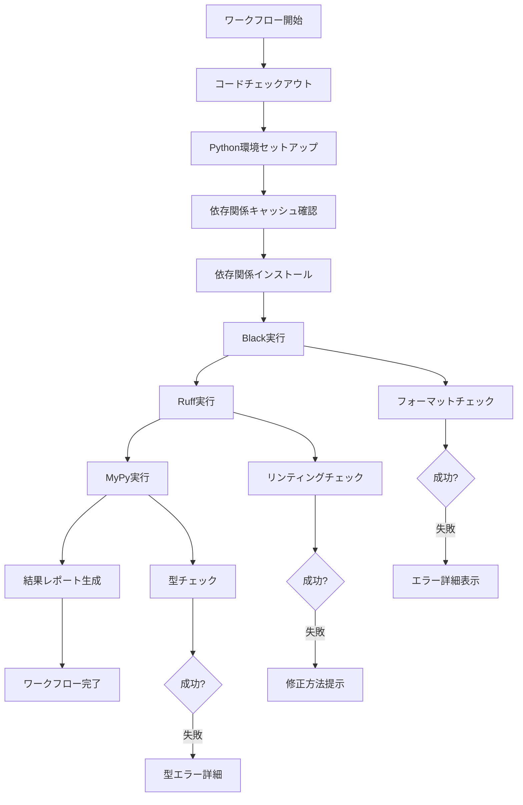

# 品質チェックワークフロー ガイド

ImgStreamプロジェクトでは、コードの品質と一貫性を保つために自動化された品質チェックワークフローを使用しています。

## 📋 目次

- [概要](#概要)
- [品質チェックツール](#品質チェックツール)
- [ワークフローの動作](#ワークフローの動作)
- [ローカル実行](#ローカル実行)
- [設定とカスタマイズ](#設定とカスタマイズ)
- [トラブルシューティング](#トラブルシューティング)
- [ベストプラクティス](#ベストプラクティス)

## 🎯 概要

品質チェックワークフロー（`.github/workflows/quality-check.yml`）は、以下の目的で設計されています：

- **コード品質の自動検証**: Black、Ruff、MyPyによる包括的なチェック
- **継続的品質保証**: プッシュやプルリクエスト時の自動実行
- **開発効率の向上**: 早期の問題発見と修正提案
- **チーム標準の統一**: 一貫したコーディングスタイルの維持

## 🛠️ 品質チェックツール

### 1. Black - コードフォーマッター

**目的**: Pythonコードの一貫したフォーマットを保証

```bash
# チェックのみ（変更なし）
uv run black --check --diff src/ tests/

# 自動フォーマット適用
uv run black src/ tests/
```

**設定** (`pyproject.toml`):
```toml
[tool.black]
line-length = 88
target-version = ['py311']
include = '\.pyi?$'
exclude = '''
/(
    \.eggs
  | \.git
  | \.mypy_cache
  | \.pytest_cache
  | \.venv
  | build
  | dist
)/
'''
```

**チェック内容**:
- 行の長さ（88文字）
- インデント（4スペース）
- 引用符の統一
- 空行の配置
- インポート文の整理

### 2. Ruff - 高速リンター

**目的**: コード品質の問題と潜在的なバグを検出

```bash
# リンティングチェック
uv run ruff check src/ tests/

# 自動修正可能な問題を修正
uv run ruff check --fix src/ tests/

# 詳細な説明付きでチェック
uv run ruff check --show-source src/ tests/
```

**主要なチェック項目**:
- **E**: PEP 8エラー
- **F**: Pyflakesエラー（未使用変数、インポートなど）
- **W**: PEP 8警告
- **C90**: 複雑度チェック
- **I**: インポート順序
- **N**: 命名規則
- **S**: セキュリティ問題（Bandit）
- **B**: Bugbearルール
- **A**: 組み込み関数のシャドウイング
- **PT**: Pytestスタイル

### 3. MyPy - 静的型チェッカー

**目的**: 型アノテーションの検証と型安全性の確保

```bash
# 型チェック実行
uv run mypy src/

# 詳細なエラー情報
uv run mypy src/ --show-error-codes --show-traceback

# 特定のファイルのみチェック
uv run mypy src/imgstream/services/auth_service.py
```

**設定** (`pyproject.toml`):
```toml
[tool.mypy]
python_version = "3.11"
strict = true
warn_return_any = true
warn_unused_configs = true
disallow_untyped_defs = true
disallow_incomplete_defs = true
check_untyped_defs = true
disallow_untyped_decorators = true
```

## ⚙️ ワークフローの動作

### 自動トリガー

品質チェックワークフローは以下の場合に自動実行されます：

1. **プッシュ時**:
   - `main`ブランチ
   - `develop`ブランチ
   - 対象パス: `src/`, `tests/`, `pyproject.toml`, `requirements*.txt`

2. **プルリクエスト時**:
   - `main`または`develop`ブランチへのPR
   - 同じ対象パスでの変更

### 手動実行

GitHub Actionsから手動でワークフローを実行できます：

1. GitHubリポジトリの「Actions」タブに移動
2. 「Quality Check」ワークフローを選択
3. 「Run workflow」をクリック
4. オプション設定:
   - **Python version**: 特定のバージョンのみテスト（空白で全バージョン）
   - **Skip cache**: 依存関係キャッシュをスキップ

### 実行環境

- **OS**: Ubuntu Latest
- **Python versions**: 3.11, 3.12, 3.13（並列実行）
- **Package manager**: uv
- **キャッシュ**: 依存関係の自動キャッシュ

### 実行フロー



## 💻 ローカル実行

### 基本的な実行方法

```bash
# 全ての品質チェックを実行
make quality-check

# または個別に実行
uv run black --check --diff src/ tests/
uv run ruff check src/ tests/
uv run mypy src/
```

### 開発ワークフロー

1. **コード変更前**:
   ```bash
   # 現在の状態を確認
   make quality-check
   ```

2. **コード変更中**:
   ```bash
   # 自動修正を適用
   uv run black src/ tests/
   uv run ruff check --fix src/ tests/
   ```

3. **コミット前**:
   ```bash
   # 最終チェック
   make quality-check
   
   # または詳細チェック
   ENVIRONMENT=production uv run pytest
   uv run black --check --diff src/ tests/
   uv run ruff check src/ tests/
   uv run mypy src/
   ```

### Pre-commitフックの設定

自動的な品質チェックのためにpre-commitフックを設定：

```bash
# pre-commitのインストール
uv add --dev pre-commit

# フックの設定
uv run pre-commit install

# 全ファイルに対してフックを実行
uv run pre-commit run --all-files
```

## ⚙️ 設定とカスタマイズ

### pyproject.toml設定

品質チェックツールの設定は`pyproject.toml`で管理されています：

```toml
[tool.black]
line-length = 88
target-version = ['py311']
include = '\.pyi?$'
exclude = '''
/(
    \.eggs
  | \.git
  | \.mypy_cache
  | \.pytest_cache
  | \.venv
  | build
  | dist
)/
'''

[tool.ruff]
target-version = "py311"
line-length = 88
select = [
    "E",   # pycodestyle errors
    "F",   # pyflakes
    "W",   # pycodestyle warnings
    "C90", # mccabe complexity
    "I",   # isort
    "N",   # pep8-naming
    "UP",  # pyupgrade
    "S",   # bandit
    "B",   # flake8-bugbear
    "A",   # flake8-builtins
    "COM", # flake8-commas
    "C4",  # flake8-comprehensions
    "PT",  # flake8-pytest-style
    "RUF", # Ruff-specific rules
]
ignore = [
    "S101",  # Use of assert
    "S603",  # subprocess call
    "S607",  # Starting a process with a partial executable path
]

[tool.ruff.per-file-ignores]
"tests/**/*.py" = [
    "S101",  # Use of assert in tests is OK
    "PLR2004",  # Magic value used in comparison
]

[tool.mypy]
python_version = "3.11"
strict = true
warn_return_any = true
warn_unused_configs = true
disallow_untyped_defs = true
disallow_incomplete_defs = true
check_untyped_defs = true
disallow_untyped_decorators = true

[[tool.mypy.overrides]]
module = [
    "streamlit.*",
    "google.cloud.*",
    "PIL.*",
]
ignore_missing_imports = true
```

### ワークフロー設定のカスタマイズ

`.github/workflows/quality-check.yml`の主要な設定項目：

```yaml
# トリガー条件の変更
on:
  push:
    branches: [ main, develop, feature/* ]  # ブランチを追加
    paths:
      - 'src/**'
      - 'tests/**'
      - 'pyproject.toml'
      - 'requirements*.txt'

# Pythonバージョンの変更
strategy:
  matrix:
    python-version: ["3.11", "3.12"]  # バージョンを限定

# 追加のチェック項目
- name: Run additional checks
  run: |
    uv run bandit -r src/
    uv run safety check
```

## 🔧 トラブルシューティング

### よくある問題と解決方法

#### 1. Black フォーマットエラー

**エラー例**:
```
would reformat src/imgstream/main.py
Oh no! 💥 💔 💥
1 file would be reformatted
```

**解決方法**:
```bash
# 自動修正を適用
uv run black src/ tests/

# 特定のファイルのみ修正
uv run black src/imgstream/main.py
```

#### 2. Ruff リンティングエラー

**エラー例**:
```
src/imgstream/services/auth_service.py:15:1: F401 [*] `typing.Optional` imported but unused
src/imgstream/services/auth_service.py:23:5: E501 Line too long (92 > 88 characters)
```

**解決方法**:
```bash
# 自動修正可能な問題を修正
uv run ruff check --fix src/ tests/

# 手動修正が必要な問題を確認
uv run ruff check src/ tests/ --show-source

# 特定のルールを無視（推奨しない）
# ファイルの先頭に追加: # ruff: noqa: F401
```

#### 3. MyPy 型チェックエラー

**エラー例**:
```
src/imgstream/services/storage_service.py:45: error: Function is missing a return type annotation
src/imgstream/models/user.py:12: error: Incompatible types in assignment (expression has type "str", variable has type "int")
```

**解決方法**:
```bash
# 詳細なエラー情報を確認
uv run mypy src/ --show-error-codes

# 型アノテーションを追加
def process_image(self, image_data: bytes) -> Optional[str]:
    # 実装

# 型の修正
user_id: int = int(user_data.get("id", 0))
```

#### 4. 依存関係の問題

**エラー例**:
```
ModuleNotFoundError: No module named 'streamlit'
```

**解決方法**:
```bash
# 依存関係を再インストール
uv sync

# 開発依存関係も含めてインストール
uv sync --dev

# キャッシュをクリア
uv cache clean
```

### GitHub Actions での問題

#### 1. ワークフローが実行されない

**確認項目**:
- ブランチ名が正しいか
- 変更されたファイルがトリガー対象パスに含まれているか
- ワークフローファイルの構文が正しいか

**解決方法**:
```bash
# YAML構文チェック
python -c "import yaml; yaml.safe_load(open('.github/workflows/quality-check.yml'))"

# 手動実行でテスト
# GitHub > Actions > Quality Check > Run workflow
```

#### 2. 権限エラー

**エラー例**:
```
Permission denied: unable to write to repository
```

**解決方法**:
- リポジトリの設定でActions権限を確認
- ブランチ保護ルールを確認
- GITHUB_TOKENの権限を確認

## 📚 ベストプラクティス

### 1. 開発ワークフロー

```bash
# 1. 機能開発開始前
git checkout -b feature/new-feature
make quality-check  # 現在の状態を確認

# 2. 開発中（定期的に実行）
uv run black src/ tests/
uv run ruff check --fix src/ tests/
uv run mypy src/

# 3. コミット前
make quality-check
git add .
git commit -m "feat: add new feature"

# 4. プッシュ前
git push origin feature/new-feature
# GitHub Actionsで自動チェック実行
```

### 2. コード品質の維持

- **小さな変更を頻繁にコミット**: 品質チェックエラーを最小限に抑制
- **型アノテーションの積極的な使用**: MyPyエラーを予防
- **リンターの警告を無視しない**: 潜在的な問題の早期発見
- **定期的な設定見直し**: プロジェクトの成長に合わせて設定を調整

### 3. チーム開発

- **統一された開発環境**: 全メンバーが同じツールバージョンを使用
- **Pre-commitフックの活用**: ローカルでの自動チェック
- **コードレビューでの品質確認**: 自動チェックを補完する人的レビュー
- **継続的な改善**: 品質メトリクスの監視と改善

### 4. パフォーマンス最適化

```bash
# 並列実行でチェック時間短縮
uv run black src/ tests/ &
uv run ruff check src/ tests/ &
uv run mypy src/ &
wait

# 変更されたファイルのみチェック
git diff --name-only HEAD~1 | grep '\.py$' | xargs uv run black --check
```

### 5. 設定の最適化

```toml
# pyproject.toml - プロジェクト固有の設定例

[tool.ruff]
# プロジェクトの特性に合わせてルールを調整
select = ["E", "F", "W", "I", "N", "UP", "S", "B", "A", "PT"]
ignore = [
    "S101",  # テストでのassert使用を許可
    "E501",  # 長い行を一部許可（docstringなど）
]

# ファイル別の例外設定
[tool.ruff.per-file-ignores]
"tests/**/*.py" = ["S101", "PLR2004"]
"scripts/**/*.py" = ["T201"]  # print文を許可

[tool.mypy]
# 段階的な型チェック導入
strict = false  # 初期は緩く設定
warn_unused_ignores = true
warn_redundant_casts = true

# 外部ライブラリの型情報
[[tool.mypy.overrides]]
module = ["streamlit.*", "google.cloud.*"]
ignore_missing_imports = true
```

---

このガイドを参考に、ImgStreamプロジェクトでの品質チェックワークフローを効果的に活用してください。質問や改善提案がある場合は、GitHubのIssueまたはPull Requestでお知らせください。
